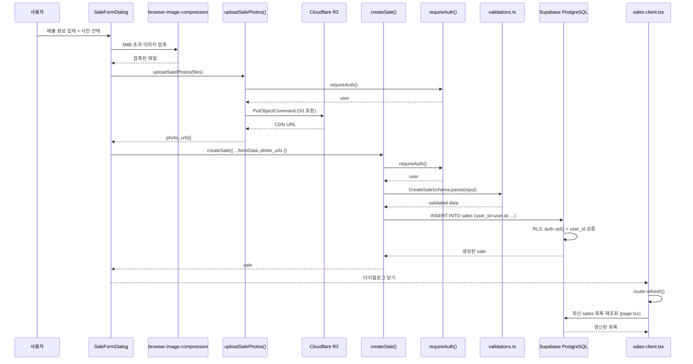
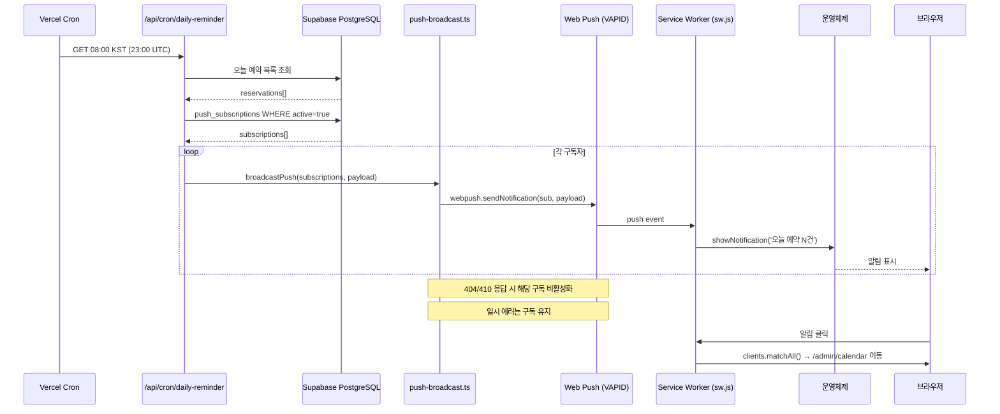
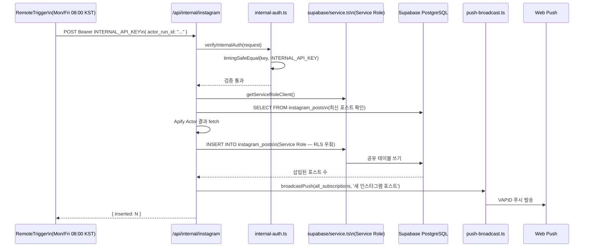
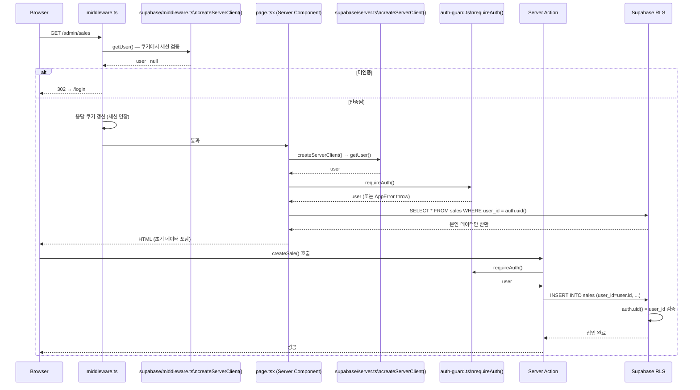

# 데이터 흐름

## 매출 등록 시퀀스

사진이 있는 매출 등록의 전체 흐름이다.

핵심 포인트:
- 사진 업로드와 매출 생성이 분리된 두 번의 Server Action 호출이다
- `user_id: user.id`는 Server Action에서 삽입 — 클라이언트가 전달하지 않음
- 변경 후 `router.refresh()`로 서버 재조회 — 클라이언트 캐시 없음

## 푸시 알림 시퀀스

일별 예약 요약 푸시 흐름 (매일 08:00 KST).

실패 처리: `web-push` 라이브러리가 푸시 서버로부터 404(구독 없음)·410(구독 만료) 응답을 받으면 `push_subscriptions.active = false`로 업데이트한다. 네트워크 일시 에러는 재시도 없이 다음 Cron 실행을 기다린다.

## 인사이트 수집 시퀀스

RemoteTrigger가 Apify를 통해 인스타그램 포스트를 수집하고 사용자에게 푸시하는 흐름이다.

핵심 포인트:
- `instagram_posts`는 공유 테이블이므로 Service Role로만 쓸 수 있다
- 일반 Server Action의 `requireAuth()` + user-scoped 패턴이 아닌, Bearer 토큰 + Service Role 경로
- 수집 성공 후 전체 활성 구독자에게 알림 브로드캐스트

## 인증 흐름

페이지 접근부터 Server Action 실행까지 인증이 검증되는 전체 경로이다.

세션 갱신 메커니즘: `middleware.ts`가 매 요청마다 `getUser()`를 호출하면 Supabase SSR이 만료 임박 토큰을 자동 갱신하고 새 쿠키를 응답에 세팅한다. 클라이언트는 별도 처리 없이 항상 유효한 세션을 유지한다.

관련 문서: [코드맵 개요](./overview.md) | [엔트리포인트](./entry-points.md) | [프로젝트 구조](../structure.md)
