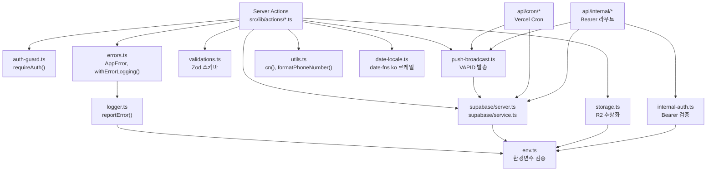

# 의존성

## 외부 의존성 그룹

### Framework (핵심 프레임워크)

`next ^16.1.6`, `react 19.2.0`, `react-dom 19.2.0`

Next.js App Router가 프로젝트의 근간이다. Server Components는 초기 데이터 fetch를 담당하고, Server Actions는 API 레이어를 대체한다. React 19는 이 패턴의 안정 버전을 제공한다. 이 의존성들은 강하게 결합되어 있으며 독립적으로 업그레이드하기 어렵다. `eslint-config-next 16.0.5`는 Next.js 버전과 맞추어야 한다.

### UI (사용자 인터페이스)

`tailwindcss ^4`, `radix-ui ^1.4.3`, `@radix-ui/react-*`, `lucide-react ^0.555.0`, `sonner ^2.0.7`, `next-themes ^0.4.6`, `@dnd-kit/*`, `react-day-picker ^9.11.3`

shadcn/ui 패턴: Radix UI 프리미티브(접근성 내장)에 Tailwind 4 스타일을 입힌 컴포넌트들이 `src/components/ui/`에 22개 존재한다. 소스 복사 방식이므로 직접 편집이 가능하다. `lucide-react`는 아이콘 단일 소스이며 `@radix-ui/*`와 함께 Tailwind 4 빌드에서 tree-shaking된다. `@dnd-kit`는 BottomNav 드래그 정렬에만 사용되며 설정 페이지에서만 로드된다.

### Data (데이터·백엔드)

`@supabase/supabase-js ^2.86.0`, `@supabase/ssr ^0.8.0`, `zod ^4.3.6`, `date-fns ^4.1.0`

Supabase는 PostgreSQL + Auth + Realtime을 제공한다. `@supabase/ssr 0.8.0`은 Next.js App Router의 쿠키 기반 세션 동기화를 공식 지원한다. Zod는 `src/lib/validations.ts`에 중앙화되어 모든 CUD 액션과 환경변수 검증에 사용된다. `date-fns`는 반드시 `src/lib/date-locale.ts`를 통해 import해야 한다 — `date-fns/locale` 직접 import 금지.

### Push (알림)

`web-push ^3.6.7`

VAPID 프로토콜로 Web Push를 발송한다. 서버사이드(Node.js)에서만 실행된다. `push_subscriptions` 테이블의 활성 구독자에게 `src/lib/push-broadcast.ts`가 일괄 발송한다. 푸시 실패 처리: 404/410(영구 실패)만 구독 비활성화, 일시 에러는 유지.

### Storage (파일 저장)

`@aws-sdk/client-s3 ^3.990.0`, `@aws-sdk/s3-request-presigner ^3.990.0`, `browser-image-compression ^2.0.2`

Cloudflare R2에 S3 호환 API로 접근한다. `next.config.ts`의 `serverExternalPackages`에 명시해 클라이언트 번들에서 제외한다. `browser-image-compression`은 클라이언트에서 3MB 초과 이미지를 업로드 전 압축한다. 내보내기용 `exceljs`, `jspdf`는 서버사이드 전용으로 필요 시 동적 import 권장.

## 내부 모듈 의존 그래프

**순환 의존 없음**: 모든 의존성은 단방향이다. `actions/*` → `lib/*` → `env.ts` 방향으로 흐른다. `lib/*` 파일들은 서로 제한적으로 의존하며 (`errors.ts` → `logger.ts`, `push-broadcast.ts` → `supabase/`), 순환이 발생하지 않는다.

## 핵심 5개 의존성 평가

### 1. Next.js 16.1.6 — 안정적, 최신 유지 권장

App Router가 React 19와 결합해 Server Components·Actions를 안정 API로 제공한다. 마이너 업데이트마다 `eslint-config-next` 버전도 함께 맞추어야 한다. `serverExternalPackages` 설정이 Node.js 전용 패키지(`@aws-sdk/*`)를 서버 번들로 올바르게 처리한다.

### 2. Supabase 2.86.0 + SSR 0.8.0 — 핵심 의존성, 신중하게 업그레이드

쿠키 기반 세션 처리가 `@supabase/ssr`에 강하게 의존한다. 업그레이드 시 `createServerClient()` API 변경 여부를 먼저 확인한다. RLS 정책은 Supabase 프로젝트 레벨에서 관리되므로 클라이언트 버전과 독립적이다.

### 3. Zod 4.3.6 — 검증 단일 소스

`src/lib/validations.ts` 하나에서 모든 스키마를 관리한다. Zod 4.x는 3.x와 일부 API 변경이 있으므로 `z.object`, `z.string`, `z.coerce` 패턴을 확인하고 사용한다.

### 4. Tailwind 4 — PostCSS 방식, 설정 구조 변경

Tailwind 4는 `tailwind.config.js`가 없고 `@tailwindcss/postcss` 플러그인 방식이다. CSS 변수(`--brand`, `--sage`)와 `globals.css`가 디자인 토큰의 단일 소스다. 클래스 병합은 `tailwind-merge` + `clsx`를 조합한 `cn()` 유틸리티를 사용한다.

### 5. web-push 3.6.7 — 서버사이드 전용, 환경변수 필수

VAPID 공개키·비밀키(`VAPID_PUBLIC_KEY`, `VAPID_PRIVATE_KEY`, `VAPID_SUBJECT`)가 환경변수로 제공되지 않으면 `env.ts` 검증에서 빌드가 실패한다. 클라이언트 번들에 포함되어서는 안 된다 — Server Action과 API Route에서만 import.

관련 문서: [코드맵 개요](./overview.md) | [기술 스택](../tech.md)
