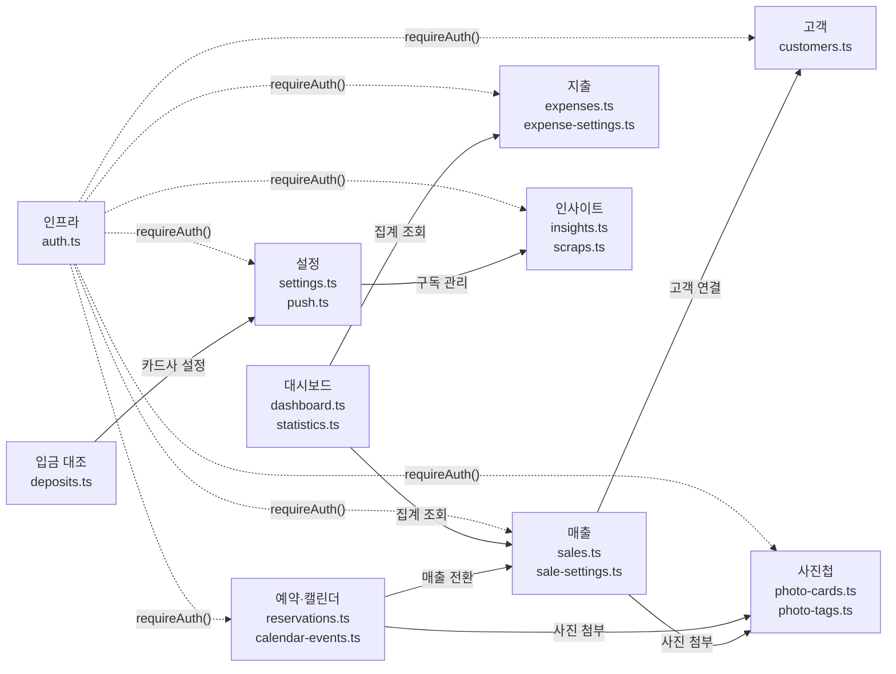

# 모듈 경계

각 도메인 모듈의 인터페이스는 `src/lib/actions/` 내 파일에서 export되는 `async function`들이다.
핵심 기능 목록은 [product.md](../product.md)를 참조한다.

## 도메인 모듈 표

### 1. 매출 (Sales)

| 항목 | 내용 |
|------|------|
| 라우트 | `/admin/sales` |
| Server Actions | `src/lib/actions/sales.ts` |
| 클라이언트 컨테이너 | `src/app/(admin)/admin/sales/sales-client.tsx` |
| 컴포넌트 | `SalesSummary`, `SalesList`, `SaleFormDialog`, `SaleDetailDialog`, `SalePhotoModal` |
| 공통 컴포넌트 | `src/components/sales/` — `SalePhotoModal`, `SalesSettingsModal`, `CustomerAutocomplete` |
| 핵심 타입 | `Sale`, `SaleCategory`, `PaymentMethod`, `Channel` |
| 주요 비즈니스 규칙 | 로드 구입 간편 모드 (현금·road 고정), 미수(unpaid) 상태 관리 (`completeUnpaidSale`, `revertUnpaidSale`), 서버사이드 검색 (ilike + 디바운스 300ms) |

### 2. 지출 (Expenses)

| 항목 | 내용 |
|------|------|
| 라우트 | `/admin/expenses` |
| Server Actions | `src/lib/actions/expenses.ts`, `src/lib/actions/expense-settings.ts` |
| 클라이언트 컨테이너 | `src/app/(admin)/admin/expenses/expenses-client.tsx` |
| 컴포넌트 | `ExpensesList` |
| 공통 컴포넌트 | `src/components/expenses/` |
| 핵심 타입 | `Expense`, `ExpenseCategory` |
| 주요 비즈니스 규칙 | 총액 = `unit_price * quantity`, 카테고리별 분류, CSV/Excel/PDF 내보내기 |

### 3. 고객 (Customers)

| 항목 | 내용 |
|------|------|
| 라우트 | `/admin/customers` |
| Server Actions | `src/lib/actions/customers.ts` |
| 클라이언트 컨테이너 | `src/app/(admin)/admin/customers/customers-client.tsx` |
| 컴포넌트 | `CustomerCard`, `CustomerFormDialog`, `CustomerDetailDialog` |
| 핵심 타입 | `Customer`, `Gender` |
| 주요 비즈니스 규칙 | 전화번호 + user_id 복합 unique 식별, 성별 선택 (male/female), 자동완성 (`CustomerAutocomplete`) |

### 4. 예약·캘린더 (Calendar)

| 항목 | 내용 |
|------|------|
| 라우트 | `/admin/calendar` |
| Server Actions | `src/lib/actions/reservations.ts`, `src/lib/actions/calendar-events.ts` |
| 클라이언트 컨테이너 | `src/app/(admin)/admin/calendar/calendar-client.tsx` |
| 핵심 타입 | `Reservation`, `CalendarEvent` |
| 주요 비즈니스 규칙 | `reminder_at` 기반 푸시 알림 발송, 캘린더에서 직접 사진 첨부·삭제 가능, 매출 전환 지원 |

### 5. 사진첩 (Gallery)

| 항목 | 내용 |
|------|------|
| 라우트 | `/admin/gallery` |
| Server Actions | `src/lib/actions/photo-cards.ts`, `src/lib/actions/photo-tags.ts` |
| 클라이언트 컨테이너 | `src/app/(admin)/admin/gallery/gallery-client.tsx` |
| 컴포넌트 | `src/components/gallery/` |
| 핵심 타입 | `PhotoCard`, `PhotoTag` |
| 주요 비즈니스 규칙 | 3MB 초과 자동 압축 (브라우저), 카드당 최대 10장, Cloudflare R2 저장 + CDN, 태그 필터 |

### 6. 입금 대조 (Deposits)

| 항목 | 내용 |
|------|------|
| 라우트 | `/admin/deposits` |
| Server Actions | `src/lib/actions/deposits.ts`, `src/lib/actions/sale-settings.ts` |
| 클라이언트 컨테이너 | `src/app/(admin)/admin/deposits/page.tsx` (Server Component) |
| 핵심 타입 | `CardCompanySetting`, `DepositRecord` |
| 주요 비즈니스 규칙 | `expected_deposit = amount * (1 - fee_rate/100)`, 영업일 기준 N일 후 입금 예정일 |

### 7. 인사이트 (Insights)

| 항목 | 내용 |
|------|------|
| 라우트 | `/admin/insights`, `/admin/insights/trends`, `/admin/insights/follows`, `/admin/insights/scraps` |
| Server Actions | `src/lib/actions/insights.ts`, `src/lib/actions/scraps.ts` |
| 클라이언트 컨테이너 | `insights-client.tsx`, `trends-client.tsx`, `follows-client.tsx`, `scraps-client.tsx` |
| 컴포넌트 | `src/components/insights/` — `category-badge`, `scrap-button`, `scrap-memo-editor` |
| Internal API | `/api/internal/trends` (POST), `/api/internal/instagram` (POST), `/api/internal/instagram-accounts` (GET) |
| 핵심 타입 | `TrendArticle`, `InstagramPost`, `InstagramAccount`, `InsightScrap` |
| 주요 비즈니스 규칙 | `insight_scraps(user_id, target_type, target_id, memo)` 복합 unique, 스크랩 필터 `?scraped=1`, 팔로우 포스트 라이트박스 (prev/next + Esc/화살표 키), `normalizeInstagramImageUrl()`로 흰 여백 제거 |

### 8. 설정 (Settings)

| 항목 | 내용 |
|------|------|
| 라우트 | `/admin/settings` |
| Server Actions | `src/lib/actions/settings.ts`, `src/lib/actions/sale-settings.ts`, `src/lib/actions/push.ts` |
| 클라이언트 컨테이너 | `src/app/(admin)/admin/settings/page.tsx` |
| 컴포넌트 | `bottom-nav-customizer` (@dnd-kit/sortable) |
| 핵심 타입 | `UserPreference`, `PushSubscription`, `CardCompanySetting` |
| 주요 비즈니스 규칙 | BottomNav 4~6개 항목 `user_preferences.bottom_nav_items` JSONB 저장, 푸시 구독 활성화·비활성화 |

### 9. 대시보드 (Dashboard)

| 항목 | 내용 |
|------|------|
| 라우트 | `/admin` |
| Server Actions | `src/lib/actions/dashboard.ts`, `src/lib/actions/statistics.ts` |
| 클라이언트 컨테이너 | `src/app/(admin)/admin/dashboard-client.tsx` |
| 핵심 타입 | `DashboardStats`, `MonthlySummary` |
| 주요 비즈니스 규칙 | 실시간 집계 (DB 하드코딩 금지), 월별 매출 합계·주요 지표 카드 |

## 모듈 인터페이스 원칙

```
모든 도메인 모듈의 공개 인터페이스 = src/lib/actions/{domain}.ts에서
export되는 async function들

규칙:
- barrel import (index.ts re-export) 금지
- 사용처에서 개별 파일 직접 import: import { createSale } from '@/lib/actions/sales'
- 모든 함수는 'use server' + withErrorLogging() + requireAuth() 보장
```

## 도메인 경계 다이어그램



관련 문서: [코드맵 개요](./overview.md) | [의존성](./dependencies.md) | [엔트리포인트](./entry-points.md)
