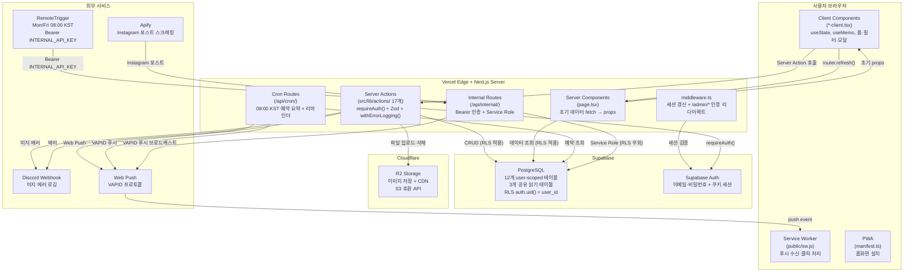

# 코드맵 개요

## 시스템 경계



## 핵심 디자인 패턴

### 패턴 1: page/client 분리 (Server/Client 경계)

```
page.tsx (Server Component)
  └── requireAuth() + Supabase 직접 조회
  └── 초기 데이터를 props로 전달
        └── *-client.tsx (Client Component)
              └── useState, useMemo, 이벤트 핸들러
              └── Server Action 호출
              └── 변경 후 router.refresh()
```

글로벌 상태 관리 라이브러리 없음. 변경 → `router.refresh()` → 서버 재조회 패턴으로 캐시 동기화.

### 패턴 2: Server Actions throw 패턴 (withErrorLogging 래퍼)

모든 Server Action은 동일한 에러 처리 구조를 따른다:

```
withErrorLogging(async () => {
  const user = await requireAuth()           // 인증
  const validated = Schema.parse(input)      // Zod 검증
  // ... Supabase CRUD ...
  return result
})

에러 분기:
  AppError (예상된 에러) → 클라이언트에 메시지 반환
  Unknown 에러           → Discord 웹훅 로깅 + 재throw
```

### 패턴 3: RLS-as-Firewall (3단 방어)

```
1단: middleware.ts        → URL 레벨 인증 리다이렉트
2단: requireAuth()        → 함수 레벨 세션 검증
3단: RLS auth.uid()=user_id → DB 레벨 데이터 격리
```

Server Action에서 `user_id` 삽입을 누락해도 RLS가 INSERT를 거부한다.

### 패턴 4: Service Role Escape Hatch

공유 데이터(트렌드, 인스타그램)는 인증 사용자 모두가 읽을 수 있지만, 쓰기는 외부 루틴만 가능하다.

```
RemoteTrigger → /api/internal/* (Bearer 검증)
                └── service.ts (Service Role 클라이언트)
                      └── RLS 우회하여 공유 테이블 INSERT
                      └── push-broadcast.ts → 전체 구독자 푸시
```

## 아키텍처 결정 사항 (ADR)

### ADR-001: 글로벌 상태 관리 없음 (useState + router.refresh)

**결정**: Zustand·Redux·React Query 등 글로벌 상태 라이브러리를 사용하지 않는다.

**이유**: Server Components가 초기 데이터를 fetch해 props로 내린다. 데이터 변경은 Server Action → `router.refresh()` → 서버 재조회로 처리한다. 이 패턴에서는 클라이언트 캐시를 별도로 관리할 필요가 없다. 상태 복잡도와 번들 크기를 줄인다.

**트레이드오프**: 낙관적 업데이트(optimistic update)가 어렵다. 사용자 수백 명 이하의 단순 CRUD 어드민에서는 허용 가능한 트레이드오프다.

### ADR-002: throw 패턴 (에러를 반환하지 않고 던짐)

**결정**: Server Action은 성공 시 데이터를 반환, 실패 시 `throw`한다. `{ data, error }` 형식을 사용하지 않는다.

**이유**: 클라이언트에서 에러 타입 분기(AppError vs Unknown)를 처리할 필요 없이, `withErrorLogging()`이 Discord 로깅을 자동으로 처리한다. `try/catch`가 클라이언트 쪽에서만 일어나므로 코드 구조가 단순하다.

**트레이드오프**: 클라이언트에서 `try/catch`로 에러를 잡아야 한다. 타입 안전성은 `AppError.code`(ErrorCode enum)로 보장한다.

### ADR-003: Cloudflare R2 (AWS S3 대신)

**결정**: 이미지 저장소로 Cloudflare R2를 선택한다.

**이유**: S3 호환 API로 `@aws-sdk/client-s3`를 그대로 사용할 수 있다. 이그레스(데이터 전송) 비용이 없다. 글로벌 CDN이 내장되어 있다. Supabase Storage보다 비용이 저렴하다.

**트레이드오프**: Supabase Storage를 쓰면 단일 플랫폼으로 통합되지만 이그레스 비용이 발생한다. 꽃집 사진 업로드량을 고려하면 R2가 유리하다.

### ADR-004: 단일 Supabase 프로젝트 멀티테넌시 (RLS 방식)

**결정**: 테넌트별 DB 분리 없이 단일 Supabase 프로젝트에 `user_id` + RLS로 멀티테넌시를 구현한다.

**이유**: 꽃집은 소규모 단독 운영이 기본이다. 별도 DB 인스턴스는 운영 부담이 크다. RLS로 DB 레벨 격리가 보장되므로 `user_id` 컬럼만 추가하면 멀티테넌시가 완성된다. `UNIQUE(column, user_id)` 복합 제약으로 사용자별 독립적인 설정도 지원한다.

**트레이드오프**: 테넌트 수가 매우 많아지면 PostgreSQL 행 수가 증가한다. 수백 개 테넌트까지는 문제없다.

### ADR-005: barrel import 금지 (직접 import 필수)

**결정**: `src/lib/actions/index.ts`에서 모든 액션을 re-export하지 않는다. 사용처에서 개별 파일을 직접 import한다.

**이유**: Next.js가 Server Action 파일을 번들링할 때 barrel import를 통하면 불필요한 코드가 클라이언트 번들에 포함될 위험이 있다. 직접 import로 tree-shaking을 보장한다.

관련 문서: [모듈 경계](./modules.md) | [데이터 흐름](./data-flow.md) | [엔트리포인트](./entry-points.md)
