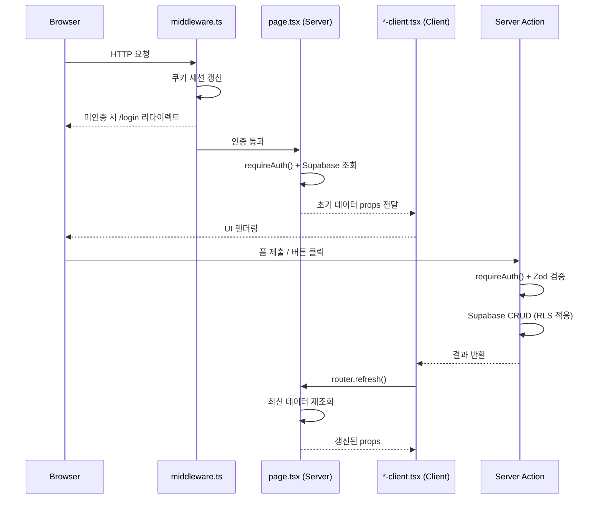

# 프로젝트 구조

## 디렉토리 트리

`feature/init-website` 브랜치 기준 — `(admin)/admin` 마이그레이션 완료 + `(public)` 신규 추가 반영.

```
src/
├── app/
│   ├── (admin)/                    # 인증 필요 어드민 라우트 그룹
│   │   └── admin/
│   │       ├── layout.tsx          # AppLayout (Sidebar + BottomNav)
│   │       ├── page.tsx            # 대시보드 서버 컴포넌트
│   │       ├── dashboard-client.tsx
│   │       ├── sales/              # 매출 관리
│   │       │   ├── page.tsx
│   │       │   ├── sales-client.tsx
│   │       │   └── components/     # SalesSummary, SalesList, SaleFormDialog, SaleDetailDialog
│   │       ├── expenses/           # 지출 관리
│   │       │   ├── page.tsx
│   │       │   ├── expenses-client.tsx
│   │       │   └── components/     # ExpensesList
│   │       ├── customers/          # 고객 관리
│   │       │   ├── page.tsx
│   │       │   ├── customers-client.tsx
│   │       │   └── components/     # CustomerCard, CustomerFormDialog, CustomerDetailDialog
│   │       ├── calendar/           # 예약 캘린더
│   │       │   ├── page.tsx
│   │       │   └── calendar-client.tsx
│   │       ├── gallery/            # 사진첩
│   │       │   ├── page.tsx
│   │       │   └── gallery-client.tsx
│   │       ├── deposits/           # 입금 대조
│   │       │   └── page.tsx
│   │       ├── insights/           # 인사이트 (랜딩)
│   │       │   ├── page.tsx
│   │       │   ├── insights-client.tsx
│   │       │   ├── trends/         # 트렌드 아티클
│   │       │   ├── follows/        # 인스타그램 팔로우 피드
│   │       │   └── scraps/         # 내 스크랩
│   │       ├── settings/           # 설정
│   │       │   ├── page.tsx
│   │       │   └── components/     # bottom-nav-customizer
│   │       ├── loading.tsx         # 공통 로딩 UI
│   │       └── error.tsx           # 에러 바운더리
│   ├── (public)/                   # 인증 불필요 공개 홈페이지 (신규)
│   │   ├── layout.tsx              # 공개 레이아웃 (PublicHeader/Footer)
│   │   └── page.tsx                # 메인 홈페이지
│   ├── api/
│   │   ├── cron/                   # Vercel Cron 라우트
│   │   │   ├── daily-reminder/     # 08:00 KST 일별 예약 요약 푸시
│   │   │   └── scheduled-reminders/ # 개별 예약 리마인더 푸시
│   │   └── internal/               # 내부 API (Bearer INTERNAL_API_KEY)
│   │       ├── trends/             # POST — 트렌드 아티클 수집 + 브로드캐스트
│   │       ├── instagram/          # POST — 인스타그램 포스트 수집 + 브로드캐스트
│   │       └── instagram-accounts/ # GET — 팔로우 계정 목록
│   ├── login/                      # 로그인 페이지 (독립 레이아웃)
│   ├── manifest.ts                 # PWA 매니페스트
│   ├── layout.tsx                  # 루트 레이아웃 (ThemeProvider, font)
│   ├── globals.css                 # CSS 변수 + Tailwind 4 설정
│   └── global-error.tsx            # 글로벌 에러 바운더리
├── components/
│   ├── ui/                         # shadcn/ui 기본 컴포넌트 22개
│   ├── layout/                     # AppLayout, Header, Sidebar, BottomNav
│   ├── public/                     # 공개 홈페이지 섹션 컴포넌트 (신규)
│   │   └── (hero, about, collection, instagram, location, order, header, footer)
│   ├── sales/                      # 매출 공통 (SalePhotoModal, CustomerAutocomplete 등)
│   ├── gallery/                    # 갤러리 공통
│   ├── expenses/                   # 지출 공통
│   ├── insights/                   # 인사이트 공통 (category-badge, scrap-button, scrap-memo-editor)
│   ├── sw-register.tsx             # Service Worker 등록
│   └── theme-provider.tsx          # next-themes 프로바이더
├── lib/
│   ├── actions/                    # Server Actions 17개 파일 (직접 import 필수)
│   │   ├── auth.ts                 # 인증 관련
│   │   ├── sales.ts                # 매출 CRUD
│   │   ├── expenses.ts             # 지출 CRUD
│   │   ├── customers.ts            # 고객 CRUD
│   │   ├── reservations.ts         # 예약 CRUD
│   │   ├── calendar-events.ts      # 캘린더 이벤트
│   │   ├── deposits.ts             # 입금 대조
│   │   ├── photo-cards.ts          # 사진 카드 CRUD
│   │   ├── photo-tags.ts           # 사진 태그
│   │   ├── insights.ts             # 인사이트 조회
│   │   ├── scraps.ts               # 스크랩 토글·메모
│   │   ├── settings.ts             # 일반 설정
│   │   ├── sale-settings.ts        # 매출 관련 설정 (카드사, 결제수단 등)
│   │   ├── expense-settings.ts     # 지출 설정
│   │   ├── push.ts                 # 푸시 구독 관리
│   │   ├── dashboard.ts            # 대시보드 집계
│   │   └── statistics.ts           # 통계 집계
│   ├── supabase/                   # Supabase 클라이언트 4종
│   │   ├── client.ts               # 브라우저용 싱글톤
│   │   ├── server.ts               # Server Component/Action용 (쿠키)
│   │   ├── middleware.ts            # 미들웨어용 (세션 갱신)
│   │   └── service.ts              # Service Role 클라이언트 (RLS 우회)
│   ├── auth-guard.ts               # requireAuth() — 모든 액션의 인증 게이트
│   ├── errors.ts                   # AppError, ErrorCode, withErrorLogging()
│   ├── validations.ts              # Zod 스키마 중앙화
│   ├── storage.ts                  # Cloudflare R2 추상화 (S3 호환)
│   ├── push-broadcast.ts           # 활성 구독자 전체 푸시 브로드캐스트
│   ├── internal-auth.ts            # Bearer INTERNAL_API_KEY timing-safe 검증
│   ├── logger.ts                   # reportError() → Discord 웹훅
│   ├── env.ts                      # 환경변수 Zod 검증 (빌드타임)
│   ├── constants.ts                # PAYMENT_LABELS, CHANNEL_LABELS, EXPENSE_LABELS
│   ├── date-locale.ts              # date-fns 한국어 로케일 추상화
│   ├── instagram-url.ts            # Instagram CDN URL stp 파라미터 정규화
│   ├── export.ts                   # ExportConfig<T>, CSV/Excel/PDF 내보내기
│   └── utils.ts                    # cn(), formatPhoneNumber(), getMonthDateRange() 등
├── types/
│   └── database.ts                 # 전체 Supabase DB 타입 정의
└── public/
    ├── sw.js                       # Service Worker (Web Push 수신·클릭 처리)
    └── icons/                      # PWA 아이콘 (192px, 512px, maskable)
```

## 라우트 그룹

Next.js App Router는 괄호 폴더 `(name)`을 URL에 포함하지 않는다. 이를 활용해 레이아웃과 인증 경계를 분리한다.

| 라우트 그룹 | URL 패턴 | 레이아웃 | 인증 |
|-------------|----------|----------|------|
| `(admin)` | `/admin/*` | AppLayout (Sidebar + BottomNav) | 필요 — middleware.ts 리다이렉트 |
| `(public)` | `/` | PublicLayout (Header + Footer) | 불필요 — 공개 접근 |
| `login` | `/login` | 독립 (레이아웃 없음) | 불필요 |
| `api/cron/*` | `/api/cron/*` | 없음 (Route Handler) | Vercel Cron Secret |
| `api/internal/*` | `/api/internal/*` | 없음 (Route Handler) | Bearer INTERNAL_API_KEY |

분리 이유: `(admin)` 그룹은 `middleware.ts`가 미인증 접근을 `/login`으로 리다이렉트한다. `(public)`은 별도의 마케팅 레이아웃(PublicHeader/Footer)을 공유한다. API 라우트는 레이아웃을 상속하지 않으므로 그룹 밖에 배치한다.

## 페이지 ↔ 클라이언트 ↔ 서버 액션 흐름



핵심 원칙: 데이터 변경은 반드시 Server Action을 통한다. 변경 후 `router.refresh()`로 서버 데이터를 다시 가져와 클라이언트 상태와 동기화한다. 글로벌 상태 관리 라이브러리(Zustand, Redux 등)는 사용하지 않는다.

## Server Actions 모듈 경계

`src/lib/actions/` 17개 파일을 도메인별로 그룹핑한다. barrel import(`index.ts`) 금지 — 직접 import 필수.

| 그룹 | 파일 | 주요 역할 |
|------|------|-----------|
| **거래** | `sales.ts`, `expenses.ts`, `deposits.ts` | 매출·지출 CRUD, 입금 대조 |
| **고객·예약** | `customers.ts`, `reservations.ts`, `calendar-events.ts` | 고객 CRUD, 예약·캘린더 이벤트 |
| **미디어** | `photo-cards.ts`, `photo-tags.ts` | 사진 업로드·삭제·태그, R2 연동 |
| **인사이트** | `insights.ts`, `scraps.ts` | 아티클·피드 조회, 스크랩 토글·메모 |
| **설정** | `settings.ts`, `sale-settings.ts`, `expense-settings.ts` | 카드사, 결제수단, 지출 설정 CRUD |
| **인프라** | `auth.ts`, `push.ts`, `dashboard.ts`, `statistics.ts` | 인증, 푸시 구독, 대시보드·통계 집계 |

모든 액션은 `'use server'` + `withErrorLogging()` 래퍼 + `requireAuth()` 가드를 포함한다.

## 컴포넌트 레이어

3층 구조로 재사용성과 응집도를 분리한다.

```
Layer 1: src/components/ui/*
  shadcn/ui 기본 프리미티브 (Button, Dialog, Select, Sheet 등 22개)
  Radix UI 기반, 스타일만 다름 — 비즈니스 로직 없음

Layer 2: src/components/{domain}/
  도메인 공통 컴포넌트 (sales/, gallery/, expenses/, insights/, layout/)
  여러 라우트에서 재사용되는 복합 컴포넌트
  예: SalePhotoModal, CustomerAutocomplete, ScrapButton

Layer 3: src/app/(admin)/admin/{route}/components/
  특정 라우트 전용 컴포넌트
  라우트 외부에서 재사용하지 않음
  예: SaleFormDialog, CustomerDetailDialog, SalesSummary
```

## 인증·인가 경계

3단 방어 구조로 인증 누락 시에도 데이터 유출을 방지한다.

```
1단: middleware.ts
   - 모든 /admin/* 요청 인터셉트
   - Supabase 쿠키 세션 갱신 (getUser()로 검증)
   - 미인증 → /login 리다이렉트

2단: requireAuth() (src/lib/auth-guard.ts)
   - 모든 Server Action 최상단에서 호출
   - 세션 없으면 AppError 던짐
   - 반환된 user.id를 INSERT user_id에 사용

3단: Supabase RLS (DB 레벨)
   - auth.uid() = user_id 정책
   - Server Action에서 user_id 삽입 누락 시에도
     다른 사용자 데이터 접근 원천 차단
```

`/api/internal/*`는 별도 인증 경로: `src/lib/internal-auth.ts`에서 `Authorization: Bearer INTERNAL_API_KEY` 헤더를 timing-safe 비교로 검증한다. 이 라우트는 Service Role 클라이언트를 사용해 RLS를 우회한다.

## 멀티테넌시 적용 레이어

| 레이어 | 구현 방식 | 위치 |
|--------|-----------|------|
| DB 스키마 | `user_id UUID NOT NULL REFERENCES auth.users(id)` | 12개 테이블 |
| DB 정책 | RLS `auth.uid() = user_id` (SELECT/INSERT/UPDATE/DELETE 분리) | Supabase RLS |
| 복합 unique | `(column, user_id)` — 사용자별 독립 설정 | 5개 테이블 |
| Server Action | `requireAuth()` 반환 `user.id` → INSERT 시 `user_id` 삽입 | `src/lib/actions/` |
| Service Role 우회 | `src/lib/supabase/service.ts` — 공유 읽기 테이블 쓰기 전용 | `api/internal/*` |

공유 테이블 (`trend_articles`, `instagram_accounts`, `instagram_posts`): SELECT는 모든 인증 사용자, 쓰기는 Service Role만 가능.

## 핵심 파일 위치 (Quick Reference)

| 파일 | 역할 | 한 줄 설명 |
|------|------|-----------|
| `src/middleware.ts` | Edge 인증 | 세션 갱신 + 미인증 /login 리다이렉트 |
| `src/lib/auth-guard.ts` | 액션 인증 가드 | `requireAuth()` — 모든 Server Action 최상단 호출 |
| `src/lib/errors.ts` | 에러 처리 | `AppError`, `ErrorCode`, `withErrorLogging()` |
| `src/lib/validations.ts` | Zod 스키마 | 모든 CUD 액션 + UUID 파라미터 + 파일 크기 검증 |
| `src/lib/supabase/client.ts` | 브라우저 클라이언트 | 싱글톤, Client Component용 |
| `src/lib/supabase/server.ts` | 서버 클라이언트 | 쿠키 기반, Server Component·Action용 |
| `src/lib/supabase/service.ts` | Service Role 클라이언트 | RLS 우회, `api/internal/*` 전용 |
| `src/lib/supabase/middleware.ts` | 미들웨어 클라이언트 | 세션 갱신 전용 |
| `src/lib/storage.ts` | R2 스토리지 추상화 | `uploadFile()`, `deleteFile()`, presigned URL |
| `src/lib/push-broadcast.ts` | 푸시 브로드캐스트 | 모든 활성 구독자에게 Web Push 발송 |
| `src/lib/internal-auth.ts` | 내부 API 인증 | Bearer 토큰 timing-safe 검증 |
| `src/lib/env.ts` | 환경변수 검증 | Zod로 빌드타임 검증, 누락 시 빌드 실패 |
| `src/types/database.ts` | DB 타입 정의 | Supabase 테이블·뷰·함수 전체 타입 |

관련 문서: [제품 개요](./product.md) | [기술 스택](./tech.md) | [코드맵 개요](./codemaps/overview.md)
