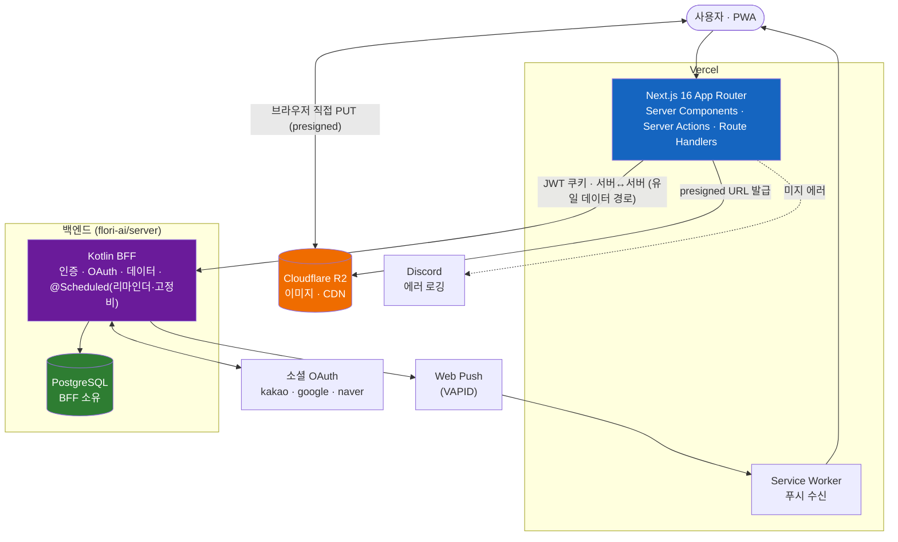
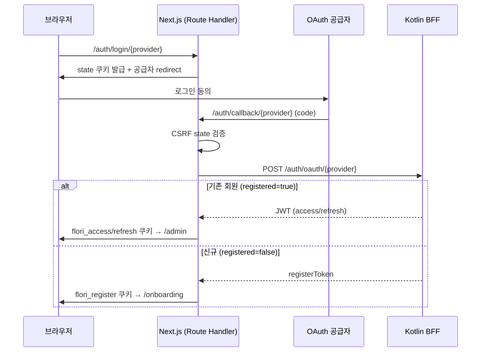

# flori

> 꽃집 매출·지출·고객·예약·인사이트를 한 곳에서 관리하는 멀티테넌트 PWA 어드민


---

## 목차

- [Quick Start](#quick-start)
- [환경 설정](#환경-설정)
- [아키텍처](#아키텍처)
- [프로젝트 구조](#프로젝트-구조)
- [멀티테넌시](#멀티테넌시)
- [주요 기능](#주요-기능)
- [CI/CD](#cicd)

---

## Quick Start

### 필수 요구사항

- Node.js 22+
- npm
- [Cloudflare R2](https://www.cloudflare.com/developer-platform/r2/) 버킷
- Kotlin BFF 서버 (`flori-ai/server`) 기동 — 인증·데이터 API (`API_URL`)

### 실행

```bash
# 1. 의존성 설치
npm install

# 2. 환경변수 설정 (.env.local 생성 — 아래 표 참조)

# 3. Kotlin BFF 서버 기동 (flori-ai/server, 기본 :8080)

# 4. 개발 서버 실행
npm run dev
```

http://localhost:3100 접속.

```bash
npm run build        # 프로덕션 빌드
npm run lint         # ESLint
npm test             # Vitest 1회 실행
npm run test:watch   # Vitest watch 모드
```

> 환경변수 값은 팀 리드에게 문의하세요.

---

## 환경 설정

`.env.local` 을 프로젝트 루트에 생성합니다. (빌드 타임에 `src/lib/env.ts` Zod 스키마로 검증 — 필수 누락 시 빌드 실패)

| 변수 | 설명 | 필수 | 기본값 |
|------|------|------|--------|
| `API_URL` | Kotlin BFF 베이스 URL (서버 전용, 데이터·인증) | O | `http://localhost:8080` |
| `R2_ACCOUNT_ID` | Cloudflare R2 계정 ID | O | - |
| `R2_ACCESS_KEY_ID` | R2 액세스 키 | O | - |
| `R2_SECRET_ACCESS_KEY` | R2 시크릿 키 | O | - |
| `R2_BUCKET_NAME` | R2 버킷명 | O | - |
| `R2_PUBLIC_URL` | R2 퍼블릭(CDN) URL | O | - |
| `NEXT_PUBLIC_VAPID_PUBLIC_KEY` | Web Push VAPID 공개키 | O | - |
| `INTERNAL_API_KEY` | BFF `/internal/*` 호출용 Bearer 키 (32자 이상) | O | - |
| `DISCORD_WEBHOOK_URL` | 에러 로깅 웹훅 | - | - |
| `OAUTH_KAKAO_REST_API_KEY` | 카카오 OAuth (서버 전용) | - | - |
| `OAUTH_GOOGLE_CLIENT_ID` | 구글 OAuth (서버 전용) | - | - |
| `OAUTH_NAVER_CLIENT_ID` | 네이버 OAuth (서버 전용) | - | - |

> `NEXT_PUBLIC_` 접두사가 없는 변수는 서버 전용이며 브라우저에 노출하지 않습니다.

---

## 아키텍처



> 상세 아키텍처 및 기술 선정 이유는 [`docs/ARCHITECTURE.md`](docs/ARCHITECTURE.md) 참조

### 소셜 로그인 흐름



- **Next.js (Vercel)**: 서버 컴포넌트 데이터 fetch, Server Action(CUD), Route Handler(OAuth)
- **Kotlin BFF**: 인증·OAuth·온보딩 + 비즈니스 데이터의 **유일한 경로**. Next 서버 레이어에서 JWT 쿠키로 서버↔서버 호출(`apiFetch`)하며, BFF가 DB(PostgreSQL)를 소유하고 테넌트 격리·카드수수료 계산을 수행. 예약 리마인더·고정비 생성은 BFF의 `@Scheduled`가, 웹푸시 발송도 BFF가 담당
- **Cloudflare R2**: 이미지 저장. Vercel 4.5MB 본문 제한을 우회하기 위해 presigned URL 로 브라우저가 R2에 직접 PUT
- web은 DB에 직접 연결하지 않는다 (Supabase 클라이언트 없음)

---

## 프로젝트 구조

```
src/
├── app/
│   ├── (public)/          # 공개 홈페이지 (인증 불필요, /)
│   ├── (admin)/admin/     # 어드민 라우트 (인증 필요, /admin/*)
│   │   ├── sales/ expenses/ customers/
│   │   ├── gallery/ calendar/ insights/ settings/
│   ├── auth/              # 소셜 OAuth Route Handlers
│   ├── onboarding/        # 소셜 신규 가입 온보딩
│   ├── policy/            # 정책 문서 (개인정보/이용약관)
│   ├── login/             # 로그인 (소셜 전용)
│   └── manifest.ts        # PWA 매니페스트
├── components/
│   ├── ui/                # shadcn/ui
│   ├── layout/            # AppLayout, Header, Sidebar, BottomNav
│   ├── public/            # 공개 홈페이지 섹션
│   └── {sales,gallery,expenses,insights,auth}/
├── lib/
│   ├── actions/           # Server Actions
│   ├── api/               # Kotlin BFF 클라이언트 (apiFetch / apiFetchInternal)
│   ├── storage.ts         # Cloudflare R2 추상화
│   ├── validations.ts     # Zod 스키마
│   ├── errors.ts          # AppError, withErrorLogging()
│   └── ...                # auth-guard, logger, export, env, utils
├── types/database.ts      # 타입 정의
└── public/
    ├── sw.js              # Service Worker
    └── icons/             # PWA 아이콘
```

---

## 멀티테넌시

단일 배포로 여러 독립 꽃집을 운영하며, 테넌트 격리는 BFF가 담당합니다.

| 항목 | 내용 |
|------|------|
| 격리 방식 | Kotlin BFF가 JWT 기준으로 테넌트를 격리 (web은 `user_id` 미전송, DB 직접 접근 없음) |
| DB 스키마 | `user_id` 컬럼 + `(column, user_id)` 복합 unique — BFF가 소유·관리 |

---

## 주요 기능

| 영역 | 기능 |
|------|------|
| 매출 | 등록/수정/삭제, 카테고리·결제방식·채널 다중선택 필터, 카드 수수료 자동계산, 사진 첨부(R2), 로드 구입 간편 모드, 미수(외상) 관리 |
| 지출 | 등록/수정/삭제, 단가×수량, 고정비(주/월/연 반복 + 자동 생성, iOS식 이것만/이후 모두 수정) |
| 고객 | 전화번호 기반 식별, 구매 이력 연동, 매출 등록 시 자동완성 |
| 예약 | 캘린더 CRUD, 예약→매출 전환, 리마인더 푸시 |
| 사진첩 | 완성작 카드, 색상 태그, 드래그 정렬, 매출 연동 |
| 인사이트 | 트렌드 아티클·인스타그램 피드, 스크랩/메모 |
| 대시보드 | 당일 매출 요약, 월간 분석, 실시간 집계 |
| PWA & 푸시 | 모바일 설치, 매일 08:00 KST 예약 요약, 예약별 리마인더 |
| 기타 | 라이트/다크 모드, BottomNav 커스텀(4~6개, 드래그 정렬), CSV/Excel/PDF 내보내기 |

---

## CI/CD


| 단계 | 설명 |
|------|------|
| 검증 | GitHub Actions — ESLint, 타입 체크, Vitest, 빌드 |
| 배포 | Vercel 자동 배포 (Git 연동) |
| 스케줄 | 예약 리마인더·고정비 생성은 Kotlin BFF의 `@Scheduled`가 담당 (web에 Cron 없음) |
| 모니터링 | 미지 에러 → Discord 웹훅 (`withErrorLogging`) |
