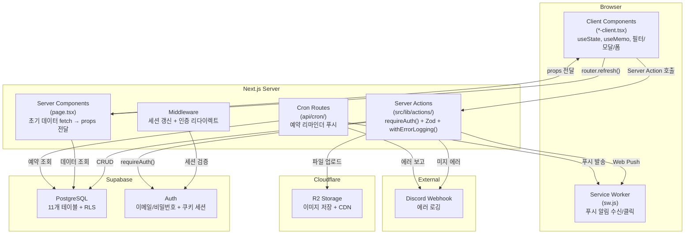
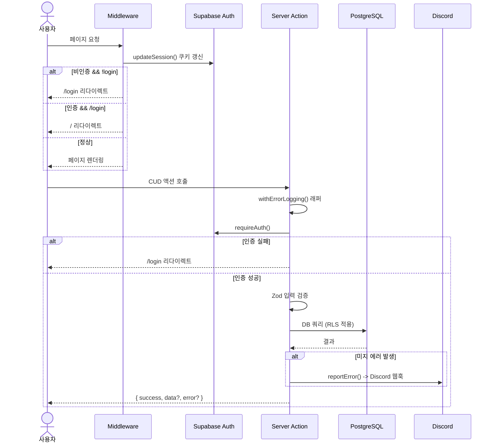
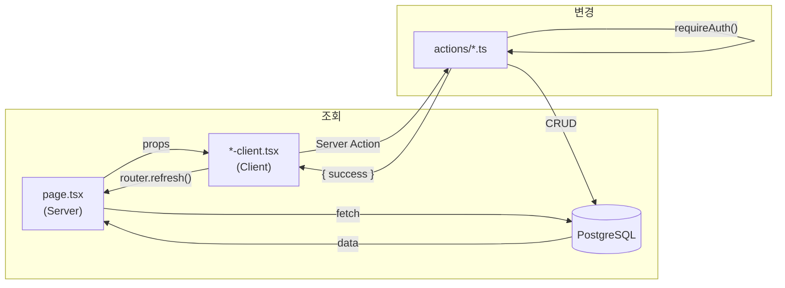
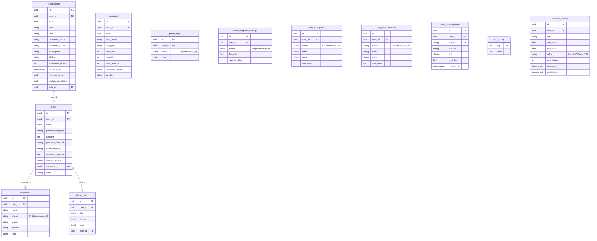

# Hazel Admin - 아키텍처 & 기술 선정 이유

> 최종 업데이트: 2026-02-20

이 문서는 Hazel Admin의 기술 스택과 아키텍처를 설명한다. 단순히 "무엇을 쓰는가"가 아니라 **"왜 이것을 골랐는가"**에 초점을 맞춘다. 모든 선택에는 꽃집 어드민이라는 도메인 맥락이 반영되어 있다.

---

## 아키텍처 개요



핵심 원칙: **Server Components가 데이터를 fetch하고, Client Components는 UI만 담당한다.** 데이터 변경은 Server Actions를 통해서만 일어나며, 변경 후 `router.refresh()`로 서버 데이터를 다시 가져온다. 이 패턴 덕분에 클라이언트 캐시나 글로벌 상태 관리 라이브러리가 필요 없다.

---

## 기술 스택 선정 이유

### Next.js 16 (App Router) + React 19

**왜 Next.js인가:**

이 프로젝트의 핵심 요구사항은 CRUD 어드민이다. 매출 목록을 불러오고, 폼으로 등록하고, 수정하고, 삭제한다. SEO는 필요 없지만, Next.js App Router의 **Server Components + Server Actions 조합**이 이 패턴에 정확히 맞는다.

- **Server Components**: `page.tsx`에서 Supabase를 직접 호출해서 데이터를 fetch한 뒤 props로 Client Component에 내린다. 별도의 API 엔드포인트를 만들 필요가 없다. 초기 페이지 로딩 시 JavaScript 번들에 데이터 fetching 로직이 포함되지 않아 클라이언트 번들이 작아진다.
- **Server Actions**: `'use server'` 함수 하나로 DB 접근이 가능하다. Express나 API Routes 같은 별도 API 레이어 없이 `createSale()`, `updateCustomer()` 같은 함수를 직접 호출한다. FormData를 받아서 Zod로 검증하고, Supabase에 쿼리하고, 결과를 반환하는 것이 한 파일 안에서 끝난다.
- **Route Group**: `(dashboard)` 그룹으로 사이드바 레이아웃을 적용하면서 `/login`은 별도 레이아웃을 쓴다. App Router의 중첩 레이아웃 시스템이 이걸 자연스럽게 지원한다.

**왜 Vite + React SPA가 아닌가:** SPA로 만들면 클라이언트에서 Supabase를 직접 호출하거나, 별도 API 서버를 두어야 한다. Server Components/Actions 패턴이 API 레이어를 완전히 대체하기 때문에 개발 속도와 유지보수 모두에서 유리하다.

**왜 Remix가 아닌가:** Remix의 loader/action 패턴은 비슷한 장점을 제공하지만, `@supabase/ssr` 공식 가이드가 Next.js 중심이고 shadcn/ui 생태계와의 호환성이 검증되어 있다.

**왜 React 19인가:** Server Components와 Server Actions가 React 19에서 안정 API로 확정되었다. `use()` 훅, 폼 관련 개선 등 최신 기능을 활용한다.

| 탈락 후보 | 이유 |
|-----------|------|
| Vite + React SPA | 별도 API 서버 필요. 클라이언트 직접 DB 호출은 보안 위험 |
| Remix | Supabase SSR 공식 가이드 부재, 커뮤니티 규모 차이 |
| Nuxt (Vue) | React 생태계(shadcn/ui, Radix)를 사용하기 위해 React가 필요 |

---

### Supabase (PostgreSQL)

**왜 Supabase인가:**

꽃집 데이터는 본질적으로 관계형이다. 매출은 고객과 연결되고, 사진첩은 매출과 연결되고, 예약은 매출로 전환된다. 매출 집계 쿼리(SUM, GROUP BY, 윈도우 함수)가 통계 페이지의 핵심이다. 이런 요구사항에는 PostgreSQL이 가장 적합하다.

Supabase를 선택한 구체적 이유:

1. **Auth 내장**: 이메일/비밀번호 인증이 기본 제공된다. `@supabase/ssr`로 Next.js App Router의 쿠키 기반 세션을 공식 지원한다. 인증 시스템을 직접 구현할 필요가 없다.
2. **RLS (Row Level Security)**: `auth.uid() = user_id` 정책으로 DB 레벨에서 접근 제어가 된다. Server Action에서 실수로 인증 체크를 빠뜨려도 RLS가 2차 방어선 역할을 한다. 멀티 테넌시도 RLS만으로 해결된다.
3. **무료 플랜**: 소규모 꽃집 운영에 충분한 500MB DB, 5GB 대역폭, 50,000 MAU를 무료로 제공한다.
4. **PostgreSQL 그 자체**: JSON 컬럼(사진 메타데이터), 배열 타입(태그), UUID PK, timestamptz 등 PostgreSQL의 풍부한 타입 시스템을 그대로 활용한다.

**멀티 테넌시 구현**: 모든 테이블에 `user_id` 컬럼을 추가하고, RLS 정책에서 `auth.uid() = user_id`를 적용했다. 이렇게 하면 한 Supabase 프로젝트로 여러 사용자(꽃집)를 지원할 수 있고, 데이터 격리가 DB 레벨에서 보장된다. 별도의 테넌트 인프라가 필요 없다. UNIQUE 제약도 `(value, user_id)` 복합키로 걸어서 사용자별 독립적인 설정을 지원한다.

| 탈락 후보 | 이유 |
|-----------|------|
| Firebase (Firestore) | NoSQL이라 매출 집계 쿼리(SUM, GROUP BY)에 부적합. 관계형 데이터 모델에 안 맞음 |
| PlanetScale (MySQL) | FK 미지원(Vitess 제약). 무료 플랜 종료(2024) |
| 직접 PostgreSQL + Prisma | Auth, RLS를 전부 직접 구현해야 함. 인프라 관리 부담 |
| MongoDB Atlas | NoSQL. 이 프로젝트의 데이터 모델(매출-고객-사진 관계)에 안 맞음 |

---

### shadcn/ui + Tailwind CSS v4

**왜 shadcn/ui인가:**

shadcn/ui는 라이브러리가 아니다. 컴포넌트 코드를 프로젝트에 직접 복사해서 쓰는 방식이다. 이게 왜 중요하냐면:

1. **100% 커스터마이징**: `node_modules` 안에 숨어 있지 않아서 Dialog, Select, Popover 등을 꽃집 브랜드에 맞게 자유롭게 수정할 수 있다. Warm Coral(`#E5614E`) 브랜드 컬러를 CSS 변수로 주입하면 모든 컴포넌트에 일관되게 적용된다.
2. **Radix UI 기반 접근성**: Dialog의 포커스 트래핑, Select의 키보드 내비게이션, Popover의 ARIA 속성 등이 Radix에 의해 자동 처리된다. 접근성을 직접 구현하는 것은 버그가 많고 시간이 오래 걸린다.
3. **Tailwind과의 자연스러운 통합**: 스타일링이 전부 Tailwind 클래스로 되어 있어서 별도 CSS-in-JS 런타임이 없다.

**왜 Tailwind CSS v4인가:**

1. **CSS 변수 기반 다크모드**: `:root`에 라이트 테마 변수를, `.dark`에 다크 테마 변수를 정의하면 `next-themes`가 클래스를 토글해준다. `bg-card`, `text-foreground` 같은 시맨틱 클래스만 쓰면 다크모드가 자동으로 적용된다.
2. **개발 속도**: 유틸리티 클래스로 인라인 스타일링하면 CSS 파일을 별도로 관리할 필요가 없다. CRUD 어드민처럼 UI 요소가 많은 프로젝트에서 생산성이 높다.
3. **Tailwind v4의 개선점**: `@theme inline` 블록으로 디자인 토큰을 CSS 변수와 직접 매핑. `@tailwindcss/postcss`로 빌드 설정이 단순해짐. `tw-animate-css`로 애니메이션 유틸리티를 활용.

| 탈락 후보 | 이유 |
|-----------|------|
| MUI (Material UI) | emotion 런타임 CSS-in-JS로 번들 큼. 구글 Material 디자인이 꽃집 브랜딩과 안 맞음 |
| Ant Design | 엔터프라이즈/백오피스 느낌으로 고정적. 번들 사이즈 큼 |
| Chakra UI | Tailwind와 충돌. v3에서 Panda CSS로 전환 중이라 불안정 |
| Headless UI | 컴포넌트 수가 7개로 적음. shadcn/ui는 25개 이상 |

---

### Cloudflare R2 (이미지 스토리지)

**왜 R2인가:**

사진첩 기능은 카드당 최대 10장의 이미지를 저장한다. 꽃집 특성상 꽃다발 사진이 핵심 콘텐츠이므로 이미지 서빙 성능과 비용이 중요하다.

1. **egress 비용 0원**: R2는 다운로드(egress) 비용이 없다. S3는 GB당 $0.09, Vercel Blob은 $0.15인데, R2는 0원이다. 사진이 많아져도 비용 걱정이 없다.
2. **글로벌 CDN 내장**: Cloudflare의 글로벌 CDN이 기본 포함되어 있어서 별도의 CDN 설정 없이 TTFB ~50ms를 달성한다. `Cache-Control: public, max-age=31536000, immutable` 헤더로 CDN 캐시를 극대화했다.
3. **S3 호환 API**: AWS SDK(`@aws-sdk/client-s3`)를 그대로 사용할 수 있다. 나중에 S3로 마이그레이션하더라도 엔드포인트만 바꾸면 된다. `src/lib/storage.ts`가 이 추상화 레이어를 담당한다.
4. **서버 사이드 업로드만 허용**: R2 API 키는 서버에만 존재한다. 클라이언트에서 브라우저 압축(browser-image-compression) 후 Server Action으로 전달하면 서버가 R2에 업로드한다. 클라이언트에 스토리지 키가 노출되지 않는다.

**Supabase Storage에서 마이그레이션한 이유**: CDN 미지원으로 TTFB가 ~200ms였고, 1GB 무료 제한이 사진이 쌓이면 금방 찬다. R2로 이전하면서 성능과 비용 모두 개선되었다.

| 탈락 후보 | 이유 |
|-----------|------|
| Supabase Storage | CDN 없음, 느린 TTFB, 1GB 무료 제한 |
| AWS S3 + CloudFront | egress 비용 발생. 소규모에서 R2 대비 3배 비쌈 |
| Vercel Blob | 1GB 무료 후 GB당 $0.15. 대역폭 비용 높음 |

---

### TypeScript + Zod 4

**왜 이 조합인가:**

TypeScript만으로는 런타임 타입 안전성이 없다. 사용자 입력(FormData)은 컴파일 타임에 검증할 수 없다. Zod는 이 간극을 메운다.

1. **타입 추론 통합**: `z.infer<typeof saleSchema>`로 Zod 스키마에서 TypeScript 타입을 자동 생성한다. 스키마와 타입이 항상 동기화되어 있다.
2. **시스템 경계에서의 검증**: Server Action이 클라이언트에서 데이터를 받는 지점이 시스템 경계다. 여기서 `saleSchema.parse(data)` 한 줄로 검증과 파싱이 동시에 완료된다. 검증 실패 시 구체적인 한국어 에러 메시지가 반환된다.
3. **도메인 스키마 집중 관리**: `src/lib/validations.ts` 한 파일에 `saleSchema`, `customerSchema`, `expenseSchema`, `reservationSchema` 등 모든 도메인 스키마가 모여 있다. 검증 규칙 변경 시 한 곳만 수정하면 된다.
4. **Zod 4의 이점**: Zod 3 대비 번들 사이즈가 절반으로 줄었다. 성능도 개선되었다.

| 탈락 후보 | 이유 |
|-----------|------|
| Yup | API가 장황함. TypeScript 추론이 Zod보다 약함 |
| Joi | Node.js 서버 전용. 브라우저 지원 불완전 |
| class-validator | 데코레이터 기반이라 Server Actions FormData 검증에 안 맞음 |

---

### Vercel (배포)

**왜 Vercel인가:**

Next.js를 만든 회사의 플랫폼이다. Next.js의 모든 기능(Server Components, Server Actions, Middleware, ISR)이 zero-config로 동작한다.

1. **Cron Jobs**: `/api/cron/daily-reminder`(매일 08:00 KST 예약 요약), `/api/cron/scheduled-reminders`(개별 리마인더)를 Vercel Cron으로 실행한다. `CRON_SECRET` 헤더로 외부 호출을 차단한다. 별도의 스케줄러 인프라가 필요 없다.
2. **자동 배포**: GitHub push 시 자동 빌드/배포. PR에 Preview 배포가 생성되어 코드 리뷰 시 실제 동작을 확인할 수 있다.
3. **Edge Middleware**: `src/lib/supabase/middleware.ts`가 모든 요청에서 세션을 갱신하고 비인증 사용자를 `/login`으로 리다이렉트한다. Edge에서 실행되므로 latency가 최소화된다.

---

### next-themes (다크모드)

**왜 next-themes인가:**

SSR 환경에서 다크모드를 구현할 때 가장 큰 문제는 FOUC(Flash of Unstyled Content)다. 서버에서 렌더링한 HTML이 라이트 모드인데 클라이언트에서 다크모드로 전환되면 화면이 깜빡인다.

next-themes는 `<script>` 태그를 `<html>` 태그에 인라인으로 삽입해서 페이지 로드 전에 올바른 클래스를 적용한다. 이 방식으로 FOUC 없이 다크모드가 동작한다.

CSS 변수 기반 테마 시스템과 결합하면, `.dark` 클래스 토글 하나로 전체 앱의 컬러가 전환된다. `globals.css`의 `:root`에 라이트 테마를, `.dark`에 다크 테마를 정의해두었다.

---

### 상태 관리: useState/useMemo (글로벌 상태 없음)

**왜 상태 관리 라이브러리를 안 쓰는가:**

이 프로젝트에는 페이지 간 공유 상태가 없다. 모든 데이터의 원천(source of truth)은 서버(Supabase)이고, 흐름은 다음과 같다:

```
page.tsx(Server) -> fetch -> props -> *-client.tsx(Client) -> Server Action -> router.refresh()
```

CUD(Create/Update/Delete) 후 `router.refresh()`를 호출하면 Server Component가 다시 실행되면서 최신 데이터를 가져온다. 클라이언트 캐시를 관리할 필요가 없다.

클라이언트에서 관리하는 상태는 오직 **UI 로컬 상태**뿐이다: 모달 열림/닫힘, 필터 값, 폼 입력 값. 이런 것들은 `useState`로 충분하다.

| 탈락 후보 | 이유 |
|-----------|------|
| Redux / Zustand | 글로벌 상태가 없음. 오버엔지니어링 |
| TanStack Query | `router.refresh()` 패턴으로 서버 상태 동기화 해결. 캐싱 레이어 중복 |
| Jotai / Recoil | 페이지 간 공유 상태가 없어서 불필요 |

---

### sonner (토스트)

**왜 sonner인가:**

`toast.success('저장되었습니다')` 한 줄이면 끝이다. shadcn/ui 공식 문서에서도 Sonner를 권장한다. `theme` prop으로 next-themes와 연동하면 다크모드 토스트가 자동으로 적용된다. shadcn/ui 내장 Toast(Radix 기반)는 ToastProvider, useToast 훅 등 설정이 복잡한데, Sonner는 `<Toaster />` 하나만 추가하면 된다.

| 탈락 후보 | 이유 |
|-----------|------|
| react-hot-toast | 스타일 커스터마이징 제한적. 다크모드 연동 불편 |
| react-toastify | 번들 사이즈 큼. 자체 CSS가 Tailwind와 충돌 가능 |
| shadcn/ui Toast | Radix 기반이지만 API가 복잡 (ToastProvider, useToast 훅) |

---

### recharts (차트)

**왜 recharts인가:**

대시보드와 통계 페이지에서 바 차트, 파이 차트 수준의 시각화가 필요하다. recharts는 SVG 기반 React 컴포넌트라 선언적으로 사용할 수 있고, `ResponsiveContainer`로 반응형이 자동 지원된다. shadcn/ui 차트 템플릿이 recharts 기반이라 통합이 자연스럽다. D3를 직접 쓰거나 Nivo를 쓰면 이 규모의 차트에는 과하다.

| 탈락 후보 | 이유 |
|-----------|------|
| Chart.js + react-chartjs-2 | Canvas 기반이라 React 컴포넌트 패턴과 안 맞음 |
| Nivo | 기능 많지만 D3 전체를 포함해서 번들 사이즈 큼 |
| Victory | API가 복잡. 러닝커브 높음 |

---

### date-fns (날짜)

**왜 date-fns인가:**

함수형 API(`format`, `addDays`, `startOfMonth`)가 tree-shaking에 유리하다. 한국어 locale(`ko`)을 완벽 지원한다. `react-day-picker`(캘린더 컴포넌트)가 date-fns 기반이라 의존성이 통일된다. Moment.js는 deprecated이고, Day.js는 locale 플러그인 관리가 번거롭다. Temporal API는 아직 브라우저 지원이 불완전하다.

---

### browser-image-compression (이미지 압축)

**왜 클라이언트 압축인가:**

서버(sharp)에서 압축하면 3MB 원본이 네트워크를 타고 서버까지 간 뒤 처리된다. 클라이언트에서 미리 압축하면 네트워크 전송량이 줄고 서버 부하도 없다. Web Worker에서 실행되므로 메인 스레드가 블로킹되지 않는다. EXIF 회전도 자동으로 처리된다. 3MB 초과 시 자동 압축, 카드당 최대 10장의 제한을 클라이언트에서 적용한다.

---

### vitest + fast-check (테스트)

**왜 vitest인가:** Vite 기반이라 ESM 설정 문제 없이 바로 동작한다. Jest는 Next.js 환경에서 ESM 설정이 복잡하다. HMR 속도로 테스트가 실행된다.

**왜 fast-check인가:** 속성 기반 테스트(Property-Based Testing)로 "모든 유효한 매출 금액에 대해 포맷팅이 정상 동작한다" 같은 테스트를 작성한다. 수동으로 테스트 케이스를 나열하는 대신 fast-check가 자동으로 엣지 케이스를 탐색해준다.

---

## 인증 흐름



인증은 3중 방어로 구성된다:
1. **Middleware**: 비인증 사용자를 `/login`으로 리다이렉트 (페이지 접근 차단)
2. **requireAuth()**: 모든 CUD Server Action에서 인증 확인 (액션 실행 차단)
3. **RLS**: `auth.uid() = user_id` 정책으로 DB 레벨에서 데이터 격리 (최종 방어선)

---

## 데이터 흐름



이 패턴의 장점: 데이터의 원천(source of truth)이 항상 서버이다. 클라이언트는 서버가 내려준 props를 표시하고, 변경이 필요하면 Server Action을 호출한 뒤 `router.refresh()`로 최신 데이터를 다시 가져온다. 클라이언트 캐시 무효화, 낙관적 업데이트 같은 복잡한 로직이 필요 없다.

---

## DB 스키마



모든 주요 테이블에 `user_id` 컬럼이 있다. RLS 정책이 `auth.uid() = user_id`를 검사하므로, 한 Supabase 인스턴스에서 여러 사용자의 데이터가 완전히 격리된다. UNIQUE 제약조건은 `(value, user_id)` 복합키로 걸어서 사용자별 독립적인 카테고리/결제방식/카드사 설정을 지원한다.

---

## 라우팅

| 경로 | 페이지 | 설명 |
|------|--------|------|
| `/` | 대시보드 | 다가오는 예약 + 월별 분석 + 알림 |
| `/sales` | 매출 관리 | 카드형 목록 (일자별 그룹) + 서버사이드 필터 + 무한 스크롤 + 사진 연동 |
| `/expenses` | 지출 관리 | CRUD + 카테고리/결제방식 설정 |
| `/customers` | 고객 관리 | 카드 그리드 + 등급 + 성별 + 매출 연동 |
| `/deposits` | 입금 대조 | 카드 결제 입금 확인/취소 |
| `/gallery` | 사진첩 | 카드 CRUD + 태그 + 드래그 정렬 |
| `/calendar` | 예약 캘린더 | 예약 CRUD + 캘린더 이벤트 + 리마인더 + 매출 자동 생성 + 픽업 완료 토글 |
| `/statistics` | 통계 | 카테고리/결제/채널/고객/지출 분석 |
| `/settings` | 설정 | 카드사 수수료/입금일 + 푸시 알림 |
| `/login` | 로그인 | 이메일/비밀번호 |
| `/api/cron/daily-reminder` | Cron | 매일 08:00 KST 예약 요약 푸시 |
| `/api/cron/scheduled-reminders` | Cron | 개별 예약 리마인더 푸시 |

## Server Actions

| 파일 | 기능 |
|------|------|
| `auth.ts` | login, logout |
| `sales.ts` | createSale, updateSale, deleteSale, loadMoreSales (무한 스크롤), getSaleSuggestions (자동완성) |
| `customers.ts` | getCustomers, getCustomerById, createCustomer, updateCustomer, updateCustomerGrade, deleteCustomer, findOrCreateCustomer, getCustomerSales |
| `expenses.ts` | createExpense, updateExpense, deleteExpense, getExpenseSuggestions (자동완성) |
| `deposits.ts` | getDeposits, confirmMultipleDeposits, revertDeposit |
| `reservations.ts` | CRUD + convertReservationToSale + addPickupToSale + getReservationSuggestions (자동완성) (throw 패턴, reminder_at, pickup_completed 지원) |
| `calendar-events.ts` | getCalendarEvents, createCalendarEvent, updateCalendarEvent, deleteCalendarEvent |
| `dashboard.ts` | getDashboardTodayData, getDashboardMonthData, getTriggeredReminders, getUpcomingReservations |
| `statistics.ts` | getCategoryStats, getPaymentMethodStats, getChannelStats, getCustomerStats |
| `photo-cards.ts` | CRUD + getPhotoCardBySaleId |
| `photo-tags.ts` | CRUD |
| `sale-settings.ts` | getSaleCategories, getPaymentMethods |
| `expense-settings.ts` | getExpenseCategories, getExpensePaymentMethods |
| `settings.ts` | getCardCompanySettings, updateCardCompanySetting |
| `push.ts` | subscribeToPush, unsubscribeFromPush, getPushSubscriptionStatus, sendPushToUser, sendPushToAllUsers, sendTestNotification |

## 타입 시스템

```typescript
// src/types/database.ts
type PaymentMethod = 'cash' | 'card' | 'transfer' | 'naverpay'
type CustomerGrade = 'new' | 'regular' | 'vip' | 'blacklist'
type CustomerGender = 'male' | 'female'
type ReservationStatus = 'pending' | 'confirmed' | 'completed' | 'cancelled' // 제작 필요 | 픽업 필요 | 픽업 완료 | 취소
type DepositStatus = 'pending' | 'completed' | 'not_applicable'
type ProductCategory = 'mini_bouquet' | ... // 11종
type ReservationChannel = 'phone' | 'kakaotalk' | 'naver_booking' | 'road' | 'other'

// 2026-02-18 추가
interface CalendarEvent {
    id: string; user_id: string; title: string
    start_date: string; end_date: string; color: string // 6색 프리셋
    description: string | null
}

interface SalesFilters { category?: string; payment?: string; channel?: string } // 서버사이드 필터
```

---

## 보안

보안은 레이어별로 설계했다. 한 레이어가 뚫려도 다음 레이어가 방어한다.

| 레이어 | 구현 | 방어 대상 |
|--------|------|-----------|
| **Middleware** | Supabase Auth 쿠키 검증 + 리다이렉트 | 비인증 페이지 접근 |
| **requireAuth()** | 모든 CUD Server Action에서 호출 | 비인증 데이터 변경 |
| **RLS** | `auth.uid() = user_id` (11개 테이블, CRUD별 분리) | DB 레벨 데이터 격리 (멀티테넌시) |
| **Zod 검증** | `src/lib/validations.ts` 스키마 | 잘못된 입력 데이터 |
| **R2 서버 업로드** | S3 API 키 서버 전용, 클라이언트에 키 미노출 | 무단 파일 업로드 |
| **SQL 인젝션 방지** | `.eq()` 분리 사용, `.or()` 문자열 보간 금지, ilike 이스케이프 | SQL 인젝션 |
| **보안 헤더** | X-Frame-Options, X-Content-Type-Options, HSTS, CSP 등 6종 | XSS, 클릭재킹 |
| **CSP** | Supabase + R2 도메인만 허용 (img-src, connect-src) | 외부 리소스 로드 |
| **Server Actions** | bodySizeLimit 10MB | 대용량 공격 |
| **Cron 인증** | `CRON_SECRET` 헤더 검증 | Cron 엔드포인트 외부 호출 |
| **에러 로깅** | Discord 웹훅 (민감 정보 제거, 5분 중복 제거) | 에러 모니터링 |

---

## 에러 처리

### 왜 이렇게 설계했는가

Server Action에서 에러가 발생하면 두 가지 질문이 생긴다: (1) 사용자에게 뭘 보여줄 것인가, (2) 개발자에게 뭘 알릴 것인가. `AppError`와 `withErrorLogging()`이 이 두 질문을 분리한다.

- **예상된 에러** (입력 검증 실패, 데이터 없음, 중복): `AppError`를 throw한다. 구체적인 한국어 에러 메시지가 사용자에게 표시된다. Discord에는 전송하지 않는다.
- **미지 에러** (DB 장애, 네트워크 오류): `reportError()`로 Discord에 알린 뒤, "일시적인 오류가 발생했습니다"라는 일반 메시지로 교체한다. 사용자에게 내부 에러 디테일을 노출하지 않는다.
- **Next.js 내부 에러** (redirect, notFound): 감지해서 그대로 재throw한다. 래퍼가 가로채면 안 되는 에러다.

### 구조

```
src/lib/errors.ts     -- ErrorCode enum, AppError 클래스, withErrorLogging() 래퍼
src/lib/logger.ts     -- reportError() -> Discord 웹훅
src/app/global-error.tsx          -- Next.js 글로벌 에러 바운더리
src/app/(dashboard)/error.tsx     -- 대시보드 라우트 에러 바운더리
```

### withErrorLogging() 패턴

```typescript
export const createSale = withErrorLogging('createSale', async (data) => {
  // AppError -> 재throw (Discord 안 감)
  // unknown -> reportError() -> Discord + 일반 에러 메시지로 교체
});
```

### Discord 로깅 (reportError)

왜 Discord인가: Sentry 같은 에러 추적 서비스는 소규모 프로젝트에 과하다. Discord 웹훅은 무료이고, 모바일에서 즉시 알림을 받을 수 있다. 에러 발생 시 액션 이름, 에러 메시지, 스택 트레이스(민감 정보 제거됨)를 Embed 형태로 전송한다.

- 인메모리 중복 제거 (5분 TTL, 최대 50건)
- 스택 트레이스 민감 정보 제거 (경로, 이메일, 비밀번호, 키)
- 메시지 256자, 스택 1000자 truncate
- 개발 환경: console.error만 출력

---

## 디자인 시스템

- **폰트**: Pretendard (시스템 폰트 폴백)
- **컬러**: CSS 변수 기반 (`:root` + `.dark`)
  - 브랜드: Warm Coral `#E5614E` -- 꽃집의 따뜻한 이미지
  - 서브: Sage Green `#8B9D83` -- 자연/식물 연상
  - 배경: Warm Cream `#FAFAF8` / Dark `#1A1A19`
- **배지 패턴**: `backgroundColor: ${color}40`, `color: color`
- **라운딩**: `--radius: 0.75rem`
- **접근성**: icon button `aria-label`, `inputMode`, `autoComplete`, `prefers-reduced-motion`

---

## PWA & 푸시 알림

### 왜 PWA인가

꽃집 사장은 매장에서 스마트폰으로 매출을 등록한다. PWA로 만들면 앱스토어 배포 없이 홈 화면에 추가해서 네이티브 앱처럼 사용할 수 있다. 웹 앱 유지보수만으로 모바일 경험을 제공한다.

### 구조

```
public/sw.js                           -- Service Worker (푸시 수신/클릭)
src/app/manifest.ts                    -- PWA 매니페스트
public/icons/                          -- PWA 아이콘 (192/512, maskable)
src/lib/actions/push.ts                -- 푸시 구독/발송 Server Actions
src/app/api/cron/daily-reminder/       -- 매일 08:00 KST 예약 요약
src/app/api/cron/scheduled-reminders/  -- 개별 리마인더 발송
```

### 푸시 발송 흐름

1. 클라이언트에서 Service Worker 등록 + PushManager.subscribe()
2. 구독 정보(endpoint, keys)를 `push_subscriptions` 테이블에 저장
3. Vercel Cron 또는 수동으로 `web-push` 라이브러리를 통해 발송
4. 영구 실패(404/410)만 `is_active = false` 처리, 일시 에러는 유지

### 환경 변수

| 변수 | 용도 |
|------|------|
| `NEXT_PUBLIC_SUPABASE_URL` | Supabase 프로젝트 URL |
| `NEXT_PUBLIC_SUPABASE_ANON_KEY` | Supabase 공개 키 |
| `NEXT_PUBLIC_VAPID_PUBLIC_KEY` | Web Push 공개키 (클라이언트) |
| `VAPID_PRIVATE_KEY` | Web Push 비밀키 (서버) |
| `CRON_SECRET` | Cron 라우트 인증 |
| `DISCORD_WEBHOOK_URL` | 에러 로깅 웹훅 |
| `R2_ACCOUNT_ID` | Cloudflare 계정 ID |
| `R2_ACCESS_KEY_ID` | R2 API 토큰 Access Key |
| `R2_SECRET_ACCESS_KEY` | R2 API 토큰 Secret Key |
| `R2_BUCKET_NAME` | R2 버킷 이름 |
| `R2_PUBLIC_URL` | R2 퍼블릭 URL (커스텀 도메인) |

---

## CI/CD

- **파일**: `.github/workflows/ci.yml`
- **트리거**: PR to main/dev + push to main/dev
- **잡**: Lint -> Type Check -> Test -> Build (Node 22)
- **동시성**: 같은 브랜치에서 새 push 시 이전 실행 취소
- **보안**: `actions/checkout`, `actions/setup-node`는 커밋 해시로 고정 (supply chain attack 방지)

## 테스트

- **프레임워크**: vitest + jsdom
- **PBT**: fast-check (속성 기반 테스트)
- **테스트 파일**: `src/lib/__tests__/`
  - `sales.property.test.ts`
  - `photo-gallery.property.test.ts`
  - `validations.test.ts`
- **실행**: `npm test` / `npm run test:watch`

---

## 내보내기 (Export)

매출/지출/고객 데이터를 CSV, Excel, PDF로 내보내는 기능이 있다. `ExportConfig<T>` 제네릭 인터페이스로 타입 안전하게 설정한다.

- **CSV**: BOM 포함 UTF-8. 한글 Excel 호환.
- **Excel**: exceljs로 서식 적용 (브랜드 컬러 헤더, 통화 포맷, 자동 필터)
- **PDF**: jspdf + jspdf-autotable + NanumGothic 한글 폰트. 가로 A4 레이아웃.

모든 내보내기는 클라이언트에서 실행된다. 서버 부하 없이 브라우저에서 직접 파일을 생성한다.

---

## 핵심 의존성 버전 (2026-02-20 기준)

| 패키지 | 버전 | 용도 |
|--------|------|------|
| next | ^16.1.6 | App Router, Server Components/Actions |
| react / react-dom | 19.2.0 | UI 라이브러리 |
| @supabase/ssr | ^0.8.0 | Next.js 쿠키 기반 Supabase 세션 |
| @supabase/supabase-js | ^2.86.0 | Supabase 클라이언트 |
| @aws-sdk/client-s3 | ^3.990.0 | Cloudflare R2 (S3 호환) |
| zod | ^4.3.6 | 런타임 입력 검증 |
| tailwindcss | ^4 | 유틸리티 CSS |
| radix-ui | ^1.4.3 | 접근성 UI 프리미티브 |
| sonner | ^2.0.7 | 토스트 알림 |
| recharts | ^3.5.1 | 차트/시각화 |
| date-fns | ^4.1.0 | 날짜 유틸리티 |
| web-push | ^3.6.7 | 서버 사이드 웹 푸시 발송 |
| vitest | ^4.0.15 | 테스트 프레임워크 |
| fast-check | ^4.3.0 | 속성 기반 테스트 |
