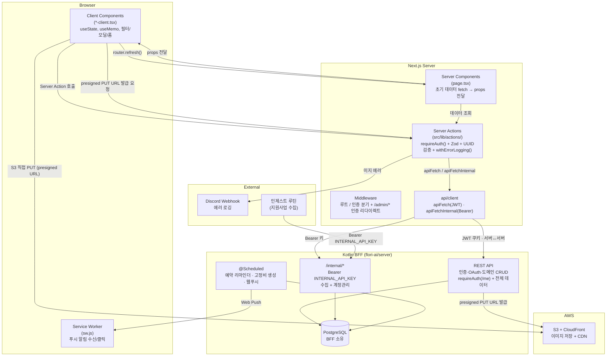
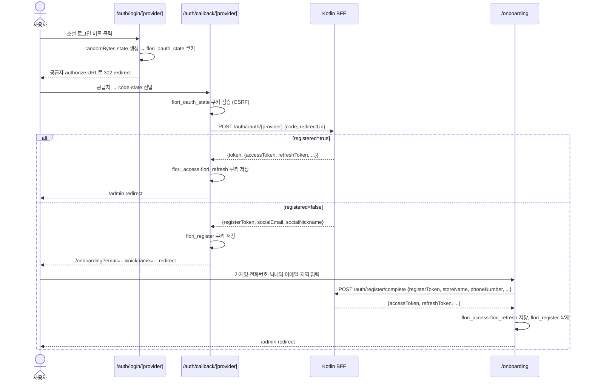
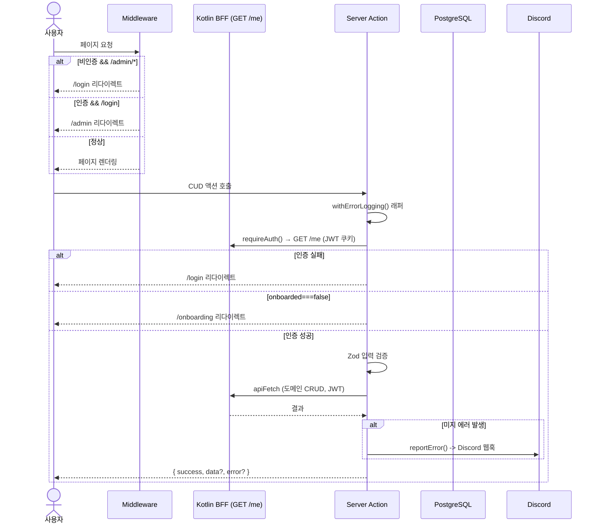
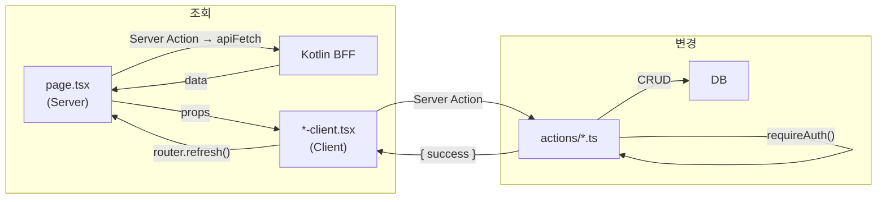

# flori - 아키텍처 & 기술 선정 이유

> 최종 업데이트: 2026-06-25 | session1-cleanup: 인사이트 트렌드 탭 제거 → 경매시세·지원사업 2탭. 경매 품목 북마크(낙관적), 지원사업 카드 클릭 상세 모달·데스크탑 2단 그리드·서버 검색. `ScrapTargetType`=grant만. trend_articles·instagram_* 테이블/타입/액션 제거

이 문서는 flori의 기술 스택과 아키텍처를 설명한다. 단순히 "무엇을 쓰는가"가 아니라 **"왜 이것을 골랐는가"**에 초점을 맞춘다. 모든 선택에는 꽃집 어드민이라는 도메인 맥락이 반영되어 있다.

---

## 아키텍처 개요



핵심 원칙: **Server Components가 데이터를 fetch하고, Client Components는 UI만 담당한다.** 데이터 변경은 Server Actions를 통해서만 일어나며, 모든 데이터 접근은 `apiFetch`로 Kotlin BFF REST를 호출한다(web은 DB에 직접 연결하지 않는다). 변경 후 `router.refresh()`로 서버 데이터를 다시 가져온다. 이 패턴 덕분에 클라이언트 캐시나 글로벌 상태 관리 라이브러리가 필요 없다.

---

## 기술 스택 선정 이유

### Next.js 16 (App Router) + React 19

**왜 Next.js인가:**

이 프로젝트의 핵심 요구사항은 CRUD 어드민이다. 매출 목록을 불러오고, 폼으로 등록하고, 수정하고, 삭제한다. SEO는 필요 없지만, Next.js App Router의 **Server Components + Server Actions 조합**이 이 패턴에 정확히 맞는다.

- **Server Components**: `page.tsx`에서 Server Action(`apiFetch`)으로 BFF에서 데이터를 fetch한 뒤 props로 Client Component에 내린다. 브라우저용 별도 API 엔드포인트를 만들 필요가 없다. 초기 페이지 로딩 시 JavaScript 번들에 데이터 fetching 로직이 포함되지 않아 클라이언트 번들이 작아진다.
- **Server Actions**: `'use server'` 함수 하나로 BFF 호출이 가능하다. 브라우저용 API Routes 없이 `createSale()`, `updateCustomer()` 같은 함수를 직접 호출한다. FormData를 받아서 Zod로 검증하고, `apiFetch`로 BFF에 요청하고, 결과를 반환하는 것이 한 파일 안에서 끝난다.
- **Route Group**: `(admin)/admin` 그룹으로 사이드바 레이아웃 + 인증 경계를 적용하고, `(console)/console` 그룹으로 슈퍼어드민 콘솔 레이아웃을 분리한다. `/login`·`/onboarding`은 별도 레이아웃을 쓴다. 랜딩·정책 문서는 이 앱에 없으며 `flori.ai.kr` 정적 사이트가 담당한다. App Router의 중첩 레이아웃 시스템이 이를 자연스럽게 지원한다.

**왜 Vite + React SPA가 아닌가:** SPA로 만들면 클라이언트에서 BFF를 직접 호출하며 JWT를 브라우저에 노출하거나 별도 BFF 레이어를 또 두어야 한다. Server Components/Actions 패턴이 서버↔서버 호출 레이어를 자연스럽게 제공해 토큰을 httpOnly 쿠키에 가둘 수 있다.

**왜 Remix가 아닌가:** Remix의 loader/action 패턴은 비슷한 장점을 제공하지만, Next.js App Router가 shadcn/ui 생태계와의 호환성이 검증되어 있고 `output: 'standalone'`으로 자체 호스팅(Docker/EC2) 패키징이 매끄럽다.

**왜 React 19인가:** Server Components와 Server Actions가 React 19에서 안정 API로 확정되었다. `use()` 훅, 폼 관련 개선 등 최신 기능을 활용한다.

| 탈락 후보 | 이유 |
|-----------|------|
| Vite + React SPA | 별도 BFF 호출 레이어 필요. 클라이언트 직접 토큰 보관은 보안 위험 |
| Remix | Next.js App Router 대비 shadcn/ui 생태계 호환 검증 부족 |
| Nuxt (Vue) | React 생태계(shadcn/ui, Radix)를 사용하기 위해 React가 필요 |

---

### Kotlin BFF (데이터 · 인증의 단일 출처)

**왜 BFF인가:**

비즈니스 데이터와 인증은 전부 Kotlin BFF(`flori-ai/server`) REST API를 통해 접근한다. web은 DB에 직접 연결하지 않으며(데이터 클라이언트 없음), Server Action이 `apiFetch`로 서버↔서버 호출만 수행한다.

이렇게 한 이유:

1. **단일 비즈니스 로직 출처**: 카드 수수료·입금 예정일·테넌트 격리 등 핵심 계산을 BFF가 JWT 기준으로 일괄 수행한다. web/모바일이 동일한 규칙을 공유하며, web은 입력값만 전달한다.
2. **멀티 플랫폼**: 동일 API를 Flutter 모바일 앱과 web이 함께 사용한다. 데이터 모델·검증·집계를 한 곳에서 관리한다.
3. **토큰 격리**: 인증 JWT는 httpOnly 쿠키(`flori_access`/`flori_refresh`)에 보관되고 서버 레이어에서만 Authorization 헤더로 부착된다. 브라우저에 노출되지 않는다.

**데이터 접근**: `src/lib/api/client.ts` 의 `apiFetch`(사용자 JWT)가 유일한 데이터 경로다. 서버에 사용자용 엔드포인트가 없는 내부 관리 작업만 `apiFetchInternal`(Bearer `INTERNAL_API_KEY`)로 BFF `/internal/*` 를 호출한다.

**멀티 테넌시**: 테넌트 격리는 BFF가 JWT 기준으로 수행한다. DB 스키마(아래 'DB 스키마')의 `user_id` 컬럼·복합 UNIQUE 제약은 BFF가 소유·적용하며, web 코드에는 더 이상 `user_id` 삽입이 없다.

> **참고**: DB(PostgreSQL)는 BFF가 소유한다. 데이터 모델은 본질적으로 관계형이며(매출-고객-사진-예약), 집계 쿼리(SUM/GROUP BY)는 BFF의 대시보드·요약 엔드포인트가 담당한다.

---

### shadcn/ui + Tailwind CSS v4

**왜 shadcn/ui인가:**

shadcn/ui는 라이브러리가 아니다. 컴포넌트 코드를 프로젝트에 직접 복사해서 쓰는 방식이다. 이게 왜 중요하냐면:

1. **100% 커스터마이징**: `node_modules` 안에 숨어 있지 않아서 Dialog, Select, Popover 등을 꽃집 브랜드에 맞게 자유롭게 수정할 수 있다. Warm Coral(`#E5614E`) 브랜드 컬러를 CSS 변수로 주입하면 모든 컴포넌트에 일관되게 적용된다.
2. **Radix UI 기반 접근성**: Dialog의 포커스 트래핑, Select의 키보드 내비게이션, Popover의 ARIA 속성 등이 Radix에 의해 자동 처리된다. 접근성을 직접 구현하는 것은 버그가 많고 시간이 오래 걸린다.
3. **Tailwind과의 자연스러운 통합**: 스타일링이 전부 Tailwind 클래스로 되어 있어서 별도 CSS-in-JS 런타임이 없다.

**왜 Tailwind CSS v4인가:**

1. **CSS 변수 기반 다크모드**: `:root`에 라이트 테마 변수를, `.dark`에 다크 테마 변수를 정의하면 `next-themes`가 클래스를 토글해준다. `bg-card`, `text-foreground` 같은 시맨틱 클래스만 쓰면 다크모드가 자동으로 적용된다.
2. **개발 속도**: 유틸리티 클래스로 인라인 스타일링하면 CSS 파일을 별도로 관리할 필요가 없다. CRUD 어드민처럼 UI 요소가 많은 프로젝트에서 생산성이 높다.
3. **Tailwind v4의 개선점**: `@theme inline` 블록으로 디자인 토큰을 CSS 변수와 직접 매핑. `@tailwindcss/postcss`로 빌드 설정이 단순해짐. `tw-animate-css`로 애니메이션 유틸리티를 활용.

| 탈락 후보 | 이유 |
|-----------|------|
| MUI (Material UI) | emotion 런타임 CSS-in-JS로 번들 큼. 구글 Material 디자인이 꽃집 브랜딩과 안 맞음 |
| Ant Design | 엔터프라이즈/백오피스 느낌으로 고정적. 번들 사이즈 큼 |
| Chakra UI | Tailwind와 충돌. v3에서 Panda CSS로 전환 중이라 불안정 |
| Headless UI | 컴포넌트 수가 7개로 적음. shadcn/ui는 25개 이상 |

---

### AWS S3 + CloudFront (이미지 스토리지)

**현재 구성:**

사진첩 기능은 카드당 최대 10장의 이미지를 저장한다. 스토리지는 Cloudflare R2에서 AWS S3 + CloudFront로 이관되었으며, presigned URL 발급 책임도 web → BFF로 이전되었다.

1. **BFF 중앙 발급**: S3 자격증명(Access Key 등)은 BFF(`flori-ai/server`)만 보유한다. web은 `POST /verification/business/upload-target` 또는 `POST /community/upload-targets` 등 BFF 엔드포인트를 통해 presigned PUT URL을 받아온다. web `src/lib/env.ts`에 S3 크레덴셜이 없다.
2. **CloudFront CDN**: 공개 읽기는 CloudFront를 통해 서빙된다(`img-src` CSP 허용 대상). S3 직접 접근은 차단.
3. **Presigned URL 직접 업로드**: Next.js Server Action 본문 크기 제한을 우회하기 위해 브라우저가 S3에 직접 PUT한다. BFF가 소유권 검증 후 presigned PUT URL 배열을 반환하면, 클라이언트(`src/lib/photo-upload.ts`)가 S3 엔드포인트로 직접 업로드한다.
4. **클라이언트 압축 제거**: 이전에는 `browser-image-compression`으로 3MB 초과 시 자동 압축했으나, 이관과 함께 제거되었다. 현재는 5MB 초과 시 하드 거부만 적용한다.
5. **환경변수**: web은 `STORAGE_PUBLIC_URL`(옵션, CloudFront 도메인) 하나만 사용한다. `next.config.ts`의 이미지 허용 호스트가 이 값에서 파생된다.

> **이관 이전(Cloudflare R2)**: egress 비용 0원, Cloudflare CDN 내장이 장점이었다. BFF 스택 통합 과정에서 AWS 생태계(S3 + CloudFront)로 일원화되었다.

---

### TypeScript + Zod 4

**왜 이 조합인가:**

TypeScript만으로는 런타임 타입 안전성이 없다. 사용자 입력(FormData)은 컴파일 타임에 검증할 수 없다. Zod는 이 간극을 메운다.

1. **타입 추론 통합**: `z.infer<typeof saleSchema>`로 Zod 스키마에서 TypeScript 타입을 자동 생성한다. 스키마와 타입이 항상 동기화되어 있다.
2. **시스템 경계에서의 검증**: Server Action이 클라이언트에서 데이터를 받는 지점이 시스템 경계다. 여기서 `saleSchema.parse(data)` 한 줄로 검증과 파싱이 동시에 완료된다. 검증 실패 시 구체적인 한국어 에러 메시지가 반환된다.
3. **도메인 스키마 집중 관리**: `src/lib/validations.ts` 한 파일에 `saleSchema`, `customerSchema`, `expenseSchema`, `reservationSchema` 등 모든 도메인 스키마가 모여 있다. 검증 규칙 변경 시 한 곳만 수정하면 된다.
4. **Zod 4의 이점**: Zod 3 대비 번들 사이즈가 절반으로 줄었다. 성능도 개선되었다.

| 탈락 후보 | 이유 |
|-----------|------|
| Yup | API가 장황함. TypeScript 추론이 Zod보다 약함 |
| Joi | Node.js 서버 전용. 브라우저 지원 불완전 |
| class-validator | 데코레이터 기반이라 Server Actions FormData 검증에 안 맞음 |

---

### AWS 자체 호스팅 (배포)

**왜 Vercel이 아니라 AWS 자체 호스팅인가:**

백엔드(Kotlin BFF)·DB(RDS PostgreSQL)·이미지(S3/CloudFront)가 이미 단일 AWS 계정(ap-northeast-2, 서울)에 있다. web만 Vercel에 두면 계정·청구·네트워크가 갈라지고 BFF 호출이 외부 경유가 된다. `next.config.ts`의 `output: 'standalone'` 덕에 Next.js 앱을 작은 Docker 이미지로 패키징할 수 있어, 같은 AWS 인프라 위에 자체 호스팅하는 편이 운영·비용·일관성에서 유리하다.

**배포 파이프라인:**

1. **빌드**: GitHub Actions(`.github/workflows/deploy-web-dev.yml`, `dev` push 트리거)가 ARM64 네이티브 러너에서 `next build`(standalone) → Docker 이미지(레포 루트 `Dockerfile`).
2. **레지스트리**: ECR `flori-dev/web` 로 push (타임스탬프+커밋 해시 태그).
3. **배포**: EC2 `flori-dev-app`에 SSH → `deploy.web.sh`가 ECR pull + `docker compose`(`--env-file .env.web`)로 web 컨테이너 기동(host `:3001` → container `:3000`).
4. **진입**: ALB host 라우팅으로 `admin.flori.ai.kr` → web TG(:3001). 랜딩 apex `flori.ai.kr` 은 별도 nginx 컨테이너(`flori-dev/homepage`)가 담당한다.
5. **빌드타임 환경변수**: `NEXT_PUBLIC_*`(VAPID·GA·Clarity)는 `next build` 시점에 클라이언트 번들에 baked되므로 **Docker build-arg**(GitHub `dev` 환경 Variables/Secrets)로 주입한다. 런타임 `.env.web`로는 바꿀 수 없다.

> 인프라 정본: `aws-infra/flori-ai-tf/`(Terraform) · `aws-infra/docs/flori/infra-overview.md`. 데이터·인증은 Supabase가 아니라 Kotlin BFF→RDS PostgreSQL(서울 리전)이 소유한다.

**왜 Remix·Nuxt가 아닌가:** Next.js App Router가 Server Components/Actions를 안정 API로 제공하고 shadcn/ui(Radix) 생태계 호환이 검증돼 있다. 호스팅은 플랫폼이 아니라 표준 Node(standalone) 런타임 위에서 돌아가므로 특정 PaaS에 종속되지 않는다.

---

### Middleware (루트 인증 분기)

`src/middleware.ts`는 Next.js 서버(self-host standalone)에서 두 단계로 동작한다. ① **루트 분기**: `pathname === '/'`일 때 인증 쿠키(`flori_access` 또는 `flori_refresh`) 존재하면 `/admin` redirect, 없으면 `/login` redirect (랜딩은 별도 사이트 `flori.ai.kr`로 이관됨). 분기 로직은 `src/lib/middleware-routing.ts`의 순수 함수 `rootRedirectTarget`으로 분리(런타임 안전, 단위 테스트 포함). ② **어드민 인증**: `/admin/*` 요청에서 refresh 쿠키 존재 여부 검사 → 없으면 `/login` redirect. 토큰 갱신은 API 클라이언트가 처리. `/onboarding`·`/auth/*`·`/healthz`는 인증 검사 없이 통과. (파일 위치: `src/middleware.ts` — Next.js `src/` 구조에서 루트 middleware는 무시되기 때문)

---

### next-themes (다크모드)

**왜 next-themes인가:**

SSR 환경에서 다크모드를 구현할 때 가장 큰 문제는 FOUC(Flash of Unstyled Content)다. 서버에서 렌더링한 HTML이 라이트 모드인데 클라이언트에서 다크모드로 전환되면 화면이 깜빡인다.

next-themes는 `<script>` 태그를 `<html>` 태그에 인라인으로 삽입해서 페이지 로드 전에 올바른 클래스를 적용한다. 이 방식으로 FOUC 없이 다크모드가 동작한다.

CSS 변수 기반 테마 시스템과 결합하면, `.dark` 클래스 토글 하나로 전체 앱의 컬러가 전환된다. `globals.css`의 `:root`에 라이트 테마를, `.dark`에 다크 테마를 정의해두었다.

---

### 상태 관리: useState/useMemo (글로벌 상태 없음)

**왜 상태 관리 라이브러리를 안 쓰는가:**

이 프로젝트에는 페이지 간 공유 상태가 없다. 모든 데이터의 원천(source of truth)은 Kotlin BFF(서버)이고, 흐름은 다음과 같다:

```
page.tsx(Server) -> fetch -> props -> *-client.tsx(Client) -> Server Action -> router.refresh()
```

CUD(Create/Update/Delete) 후 `router.refresh()`를 호출하면 Server Component가 다시 실행되면서 최신 데이터를 가져온다. 클라이언트 캐시를 관리할 필요가 없다.

클라이언트에서 관리하는 상태는 오직 **UI 로컬 상태**뿐이다: 모달 열림/닫힘, 필터 값, 폼 입력 값. 이런 것들은 `useState`로 충분하다.

| 탈락 후보 | 이유 |
|-----------|------|
| Redux / Zustand | 글로벌 상태가 없음. 오버엔지니어링 |
| TanStack Query | `router.refresh()` 패턴으로 서버 상태 동기화 해결. 캐싱 레이어 중복 |
| Jotai / Recoil | 페이지 간 공유 상태가 없어서 불필요 |

---

### sonner (토스트)

**왜 sonner인가:**

`toast.success('저장되었습니다')` 한 줄이면 끝이다. shadcn/ui 공식 문서에서도 Sonner를 권장한다. `theme` prop으로 next-themes와 연동하면 다크모드 토스트가 자동으로 적용된다. shadcn/ui 내장 Toast(Radix 기반)는 ToastProvider, useToast 훅 등 설정이 복잡한데, Sonner는 `<Toaster />` 하나만 추가하면 된다.

| 탈락 후보 | 이유 |
|-----------|------|
| react-hot-toast | 스타일 커스터마이징 제한적. 다크모드 연동 불편 |
| react-toastify | 번들 사이즈 큼. 자체 CSS가 Tailwind와 충돌 가능 |
| shadcn/ui Toast | Radix 기반이지만 API가 복잡 (ToastProvider, useToast 훅) |

---

### date-fns (날짜)

**왜 date-fns인가:**

함수형 API(`format`, `addDays`, `startOfMonth`)가 tree-shaking에 유리하다. 한국어 locale(`ko`)을 완벽 지원한다. `react-day-picker`(캘린더 컴포넌트)가 date-fns 기반이라 의존성이 통일된다. Moment.js는 deprecated이고, Day.js는 locale 플러그인 관리가 번거롭다. Temporal API는 아직 브라우저 지원이 불완전하다.

**로케일 추상화**: `src/lib/date-locale.ts`에서 `ko`를 re-export한다. 모든 컴포넌트는 `@/lib/date-locale`에서 import한다. 향후 라이브러리 교체 시 단일 변경점이 된다.

---

### 이미지 업로드 정책

**클라이언트 자동 압축 제거 (2026-05-29):**

`browser-image-compression` 의존성이 제거되었다. 이전에는 3MB 초과 시 클라이언트에서 자동 압축했으나, AWS S3 + CloudFront 이관과 함께 단순화되었다. 현재 정책은 **5MB 초과 하드 거부**만 적용한다. 카드당 최대 10장 제한은 유지된다.

---

### vitest + fast-check + Playwright (테스트)

**왜 vitest인가:** Vite 기반이라 ESM 설정 문제 없이 바로 동작한다. Jest는 Next.js 환경에서 ESM 설정이 복잡하다. HMR 속도로 테스트가 실행된다.

**왜 fast-check인가:** 속성 기반 테스트(Property-Based Testing)로 "모든 유효한 매출 금액에 대해 포맷팅이 정상 동작한다" 같은 테스트를 작성한다. 수동으로 테스트 케이스를 나열하는 대신 fast-check가 자동으로 엣지 케이스를 탐색해준다.

**왜 Playwright + mock BFF인가:** `apiFetch`는 Next.js 서버 → Kotlin BFF의 서버 간 호출이라 브라우저 레이어(`page.route()`)로는 가로챌 수 없다. 소셜 OAuth도 실 플로우를 탈 수 없다. `e2e/mock-bff/server.mjs`가 외부 의존성 0인 순수 Node HTTP 서버로 BFF 엔드포인트를 fixture 응답하고, `playwright.config.ts`의 webServer가 mock BFF(18080)와 next(3110, `API_URL=mock`)를 함께 기동한다. 로그인은 `e2e/helpers/auth.ts`의 쿠키 주입으로 처리. CI에 e2e job 추가됨.

---

## 인증 흐름

### 소셜 OAuth 플로우 (신규 가입)



### 페이지 요청 및 Server Action 흐름



인증은 3중 방어로 구성된다. `/login`·`/onboarding`·`/auth/*`·`/healthz`는 인증 불필요, `/admin/*`·`/console/*`만 인증 강제:
1. **Middleware**: `/admin/*` 접근 시 비인증 사용자를 `/login`으로 리다이렉트 (페이지 접근 차단)
2. **requireAuth()**: **읽기 포함 모든** Server Action에서 인증 확인 + 온보딩 게이트 (`onboarded === false` → `/onboarding`)
3. **BFF 테넌트 격리**: Kotlin 서버가 JWT 기준으로 사용자별 데이터를 격리 (DB 접근은 BFF만 수행)

---

## 데이터 흐름



이 패턴의 장점: 데이터의 원천(source of truth)이 항상 서버이다. 클라이언트는 서버가 내려준 props를 표시하고, 변경이 필요하면 Server Action을 호출한 뒤 `router.refresh()`로 최신 데이터를 다시 가져온다. 삭제처럼 UX 체감이 중요한 경우에는 React 19 `useOptimistic`으로 즉시 목록에서 제거하고 서버 실패 시 자동 롤백한다(`sales-client`, `customers-client`, `expenses-client`). 폼 제출 pending 상태는 `useTransition`으로 관리한다.

---

## DB 스키마

```mermaid
erDiagram
    sales ||--o| customers : "customer_id"
    sales ||--o| photo_cards : "sale_id"
    reservations ||--o| sales : "sale_id"

    sales {
        uuid id PK
        uuid user_id FK
        date date
        uuid category_id FK "sale_categories.id"
        int amount
        uuid payment_method_id FK "payment_methods.id, nullable"
        uuid channel_id FK "sale_channels.id, nullable"
        string card_company
        int expected_deposit
        string deposit_status
        uuid customer_id FK
        text memo
        bool is_unpaid
    }

    expenses {
        uuid id PK
        uuid user_id FK
        date date
        string item_name
        uuid category_id FK "expense_categories.id"
        int unit_price
        int quantity
        int total_amount
        uuid payment_method_id FK "expense_payment_methods.id"
        string vendor
        text memo
        uuid recurring_id FK "nullable, recurring_expenses.id"
        bool is_recurring_modified "고정비 단건 수정 여부"
    }

    recurring_expenses {
        uuid id PK
        uuid user_id FK
        string item_name
        uuid category_id FK "expense_categories.id"
        int unit_price
        int quantity
        uuid payment_method_id FK "expense_payment_methods.id"
        string vendor
        string frequency "weekly|monthly|yearly"
        int[] days "반복 일자 배열"
        date start_date
        date end_date "nullable"
        bool is_active
    }

    recurring_skips {
        uuid id PK
        uuid user_id FK
        uuid recurring_id FK
        date skip_date "이 날짜 생성 건너뜀"
    }

    customers {
        uuid id PK
        uuid user_id FK
        string name
        string phone "UK(phone,user_id)"
        bigint grade_id FK "customer_grades.id, nullable(soft ref)"
        bool grade_locked "true=수동고정, 자동승급 제외"
        string gender
        text memo
    }

    customer_grades {
        bigint id PK
        uuid user_id FK
        string name "UK(name,user_id)"
        int threshold "구매횟수 임계값, null=수동전용"
        int sort_order
    }

    reservations {
        uuid id PK
        uuid user_id FK
        date date
        string time
        string title
        string customer_name
        string customer_phone
        text memo
        string status
        int estimated_amount
        timestamptz reminder_at
        bool reminder_sent
        bool pickup_completed
        uuid sale_id FK
    }

    photo_cards {
        uuid id PK
        uuid user_id FK
        string title
        jsonb photos
        text[] tags
        text memo
        uuid sale_id FK
        bigint customer_id "nullable, soft ref(FK 없음)"
    }

    photo_tags {
        uuid id PK
        uuid user_id FK
        string name "UK(name,user_id)"
        string color
    }

    card_company_settings {
        uuid id PK
        uuid user_id FK
        string name "UK(name,user_id)"
        float fee_rate
        int deposit_days
    }

    sale_categories {
        uuid id PK
        uuid user_id FK
        string value "UK(value,user_id)"
        string label
        int sort_order
    }

    payment_methods {
        uuid id PK
        uuid user_id FK
        string value "UK(value,user_id)"
        string label
        int sort_order
    }

    sale_channels {
        uuid id PK
        uuid user_id FK
        string value "UK(value,user_id)"
        string label
        int sort_order
    }

    expense_categories {
        uuid id PK
        uuid user_id FK
        string value "UK(value,user_id)"
        string label
        string color
        int sort_order
    }

    expense_payment_methods {
        uuid id PK
        uuid user_id FK
        string value "UK(value,user_id)"
        string label
        string color
        int sort_order
    }

    push_subscriptions {
        uuid id PK
        uuid user_id FK
        string endpoint UK
        string p256dh
        string auth
        bool is_active
        timestamptz updated_at
    }

    app_config {
        text key PK
        text value
    }

    schedules {
        uuid id PK
        uuid user_id FK
        string title
        date start_date
        date end_date
        string color "hex (#f43f5e 등 6색)"
        text memo
        timestamptz created_at
        timestamptz updated_at
    }

    user_preferences {
        uuid id PK
        uuid user_id FK "UK"
        jsonb bottom_nav_items "4~6개 항목 순서"
        timestamptz updated_at
    }

    insight_scraps {
        uuid id PK
        uuid user_id FK
        string target_type "grant (트렌드·인스타 제거됨)"
        uuid target_id "support_programs.id (polymorphic, FK 없음)"
        text memo
        timestamptz created_at
    }
```



> 아래 스키마는 BFF가 소유한 DB의 구조다. web은 이 테이블에 직접 접근하지 않고 BFF REST를 통해서만 다룬다.

모든 주요 테이블에 `user_id` 컬럼이 있고, BFF가 JWT 기준으로 사용자별 데이터를 격리한다. UNIQUE 제약조건은 `(value, user_id)` 복합키로 걸어서 사용자별 독립적인 카테고리/결제방식/카드사 설정을 지원한다.

`user_preferences`와 `insight_scraps`는 `user_id` 기준 per-user. `insight_scraps.target_type`은 `grant`만(트렌드·인스타 스크랩 제거됨). UNIQUE 제약 `(user_id, target_type, target_id)`로 중복 스크랩을 방지한다. 경매 품목 북마크는 `insight_scraps`와 분리된 별도 엔드포인트(`/insights/auction/scraps`)로 관리한다.

---

## 라우팅

| 경로 | 페이지 | 설명 |
|------|--------|------|
| `/` | 루트 리다이렉트 | 인증 쿠키 있으면 `/admin` redirect, 없으면 `/login` redirect (미들웨어). 랜딩은 별도 정적 사이트 `flori.ai.kr`이 담당. |
| `/admin` | 대시보드 | 시간대별 인사말 + 이번 달 4 KPI + 다가오는 예약 + 커뮤니티 최신글 + flori AI 브리핑('개발 중'). 월별 분석은 `/admin/statistics`로 분리됨 |
| `/admin/statistics` | 통계 | 빠른 선택 기간 셀렉터(이번 달/지난달/최근 3개월/올해/직접 선택) + 매출·지출·예약·고객 4탭 (URL `?range&from&to&tab`). BFF `GET /statistics/{sales,expenses,reservations,customers}?from=&to=` 호출. 예약 탭에 요일×시간대 히트맵 포함 |
| `/admin/sales` | 매출 관리 | 미니멀 로우 리스트 (일자별 그룹) + 썸네일 + 서버사이드 필터(id 기반) + 기간 범위 필터 + 무한 스크롤 + FAB |
| `/admin/expenses` | 지출 관리 | 서버 페이지네이션(100건 단위 무한스크롤) + getExpensesSummary(카테고리별 비율 바) + 기간 범위 필터 + 다중선택 필터(id 기반) + FAB Speed Dial(지출 등록/고정비 관리 모달/내보내기/설정) |
| `/admin/customers` | 고객 관리 | 통합 그리드(최근구매순) + 커스텀 등급 칩 필터 + 사진 썸네일 미리보기 + FAB(등록/내보내기/등급관리) |
| `/admin/deposits` | 입금 대조 | 카드 결제 입금 확인/취소 |
| `/admin/gallery` | 사진첩 | 앨범 표지 카드(표지+장수배지+메모아이콘+캡션) + 기간 헤더(월네비+셀렉터, created_at 기준) + 총계 헤더(N개·M장) + #해시태그(색상 없음, 카드당 최대 3) + 월별 섹션 + ?card= 딥링크 + FAB(카드추가/태그관리) + 고객 딥링크·customer_id 직접 필터 |
| `/admin/calendar` | 예약 캘린더 | 예약 CRUD + 일정(schedules) + 리마인더 + 매출 자동 생성(id 기반) + 픽업 완료 토글 |
| `/admin/insights` | 인사이트 | 경매시세·지원사업 2탭 (`?tab=price|grant`). 경매시세: 화훼구분 칩(스크랩/전체/절화/관엽/난)·날짜 네비·품목 검색·드릴다운·품목 북마크. 지원사업: 데스크탑 2단 그리드·카드 클릭 상세 모달·서버 검색. 트렌드·팔로우 탭 제거됨 |
| `/admin/community` | 커뮤니티 | 게시판 목록/[id]/write/edit. 대댓글(최대 5뎁스)·좋아요·비밀글/댓글·Tiptap. BFF REST 완전 연동. 진입 시 `ensureCommunityAccess()` — APPROVED 아니면 /verify 리다이렉트(전원 인증, 운영자 예외 없음). 운영자 작성물에 "관리자" 칩 표시 |
| `/admin/community/verify` | 사업자 인증 | 사업자등록증 업로드 + 심사 상태 표시 (`BusinessVerificationGate`). APPROVED 상태이면 /admin/community로 리다이렉트 |
| `/admin/settings` | 설정 | 카드사 수수료/입금일 + 푸시 알림 + BottomNav 커스텀 + 푸시 타입별 수신 on/off 토글(PushPreferences) |
| `/auth/login/[provider]` | OAuth 개시 | CSRF state 쿠키 발급 → 공급자 authorize 화면 302 redirect (kakao·google·naver) |
| `/auth/callback/[provider]` | OAuth 콜백 | state 검증 → Kotlin BFF 토큰 교환 → registered 분기 (/admin 또는 /onboarding) |
| `/onboarding` | 온보딩 | 소셜 신규 가입 2단계 폼 (registerToken 쿠키 가드). Step1에 전화번호 필수 입력 포함 |
| `/login` | 로그인 | 소셜 전용 (카카오·네이버·구글 버튼, 이메일/비밀번호 제거됨) |
| `/healthz` | 헬스체크 | ALB/Docker 헬스체크 전용. 외부 의존 없는 정적 200 반환. |

> 예약 리마인더·고정비 생성(구 `/api/cron/*`)과 지원사업 수집(구 `/api/internal/*`)은 web에서 제거되어 Kotlin BFF가 담당한다(`@Scheduled` + `/internal/*`). 트렌드·인스타 수집 루틴은 폐기됨.

## 네비게이션 구조

| 환경 | 컴포넌트 | 설명 |
|------|----------|------|
| 데스크톱 (lg+) | `Sidebar` | 좌측 고정 사이드바, 접기/펼치기 토글 |
| 모바일/태블릿 (<lg) | `BottomNav` | 하단 고정 탭바 (4~6개, `user_preferences.bottom_nav_items` JSONB로 사용자 지정 가능) |

- `lg` 브레이크포인트(1024px) 기준으로 Sidebar는 `hidden lg:block`, BottomNav는 `lg:hidden`
- 대시보드(`/admin`)는 BottomNav 정식 항목(`NavItemKey: 'dashboard'`)으로 기본 첫 번째 위치에 배치
- iOS safe area 대응: `pb-[max(env(safe-area-inset-bottom),0.5rem)]` — 노치 없는 기기에서도 최소 0.5rem 보장
- 메인 콘텐츠에 `pb-20` (모바일), `lg:pb-8` (데스크톱) 적용하여 BottomNav와 겹침 방지

## Server Actions

| 파일 | 기능 |
|------|------|
| `auth.ts` | login, logout |
| `sales.ts` | createSale, updateSale, deleteSale, completeUnpaidSale, revertUnpaidSale, loadMoreSales (무한 스크롤), getSaleSuggestions (자동완성) |
| `customers.ts` | getCustomers, getCustomerById, createCustomer, updateCustomer, assignCustomerGrade(수동 고정), revertCustomerGradeAuto(자동 되돌리기), deleteCustomer, findOrCreateCustomer, getCustomerSales |
| `customer-grades.ts` | getCustomerGrades, createCustomerGradeConfig, updateCustomerGradeConfig, deleteCustomerGradeConfig — 테넌트별 커스텀 등급 CRUD (`GET/POST/PATCH/DELETE /customer-grades`) |
| `expenses.ts` | createExpense, updateExpense, deleteExpense, getExpenseSuggestions (자동완성), getExpenses(offset·limit·filters·dateRange → BFF `GET /expenses`), loadMoreExpenses(무한스크롤), getExpensesSummary(카테고리 슬라이스 → BFF `GET /expenses/summary`) |
| `recurring-expenses.ts` | getRecurringExpenses, createRecurringExpense, updateRecurringExpense (mode: 'this'|'future'), deleteRecurringExpense (mode: 'this'|'future'|'all'), quickAddRecurringExpense |
| `deposits.ts` | getDeposits, confirmMultipleDeposits, revertDeposit |
| `reservations.ts` | CRUD + convertReservationToSale + addPickupToSale + getReservationSuggestions (자동완성) (throw 패턴, reminder_at, pickup_completed 지원) |
| `schedules.ts` | getSchedules, createSchedule, updateSchedule, deleteSchedule (BFF `/schedules?month=`) |
| `dashboard.ts` | getDashboardTodayData, getDashboardMonthData, getTriggeredReminders, getUpcomingReservations |
| `statistics.ts` | `getSalesStatistics`, `getExpensesStatistics`, `getReservationStatistics`, `getCustomerStatistics` — BFF `GET /statistics/{sales,expenses,reservations,customers}?from=&to=`. ISO 날짜 형식 가드(`assertIsoDate`) 포함. (구 `getCategoryStats`·`getPaymentMethodStats`·`getChannelStats`·`getCustomerStats`·`getExpenseCategoryStats` 는 제거됨) |
| `photo-cards.ts` | CRUD + getPhotoCardBySaleId + getPhotoCardById + createPhotoUploadTargets (presigned PUT URL 발급, 소유권 검증) |
| `photo-tags.ts` | CRUD |
| `sale-settings.ts` | getSaleCategories, getPaymentMethods, getSaleChannels, createSaleCategory, updateSaleCategory, deleteSaleCategory, **reorderSaleCategories** (`PUT /settings/sale-categories/order`), createPaymentMethod, updatePaymentMethod, deletePaymentMethod, **reorderPaymentMethods** (`PUT /settings/payment-methods/order`), createSaleChannel, updateSaleChannel, deleteSaleChannel, **reorderSaleChannels** (`PUT /settings/sale-channels/order`) |
| `expense-settings.ts` | getExpenseCategories, getExpensePaymentMethods, createExpenseCategory, updateExpenseCategory, deleteExpenseCategory, **reorderExpenseCategories** (`PUT /settings/expense-categories/order`), createExpensePaymentMethod, updateExpensePaymentMethod, deleteExpensePaymentMethod, **reorderExpensePaymentMethods** (`PUT /settings/expense-payment-methods/order`) |
| `push.ts` | subscribeToPush, unsubscribeFromPush, getPushSubscriptionStatus, sendTestNotification(type?) (BFF `POST /push/test?type=`), getPushPreferences (BFF `GET /push/preferences`), setPushPreference(type, enabled) (BFF `PUT /push/preferences`) |
| `insights.ts` | getUserPreferences, updateBottomNavItems |
| `auction.ts` | getAuctionCategories, getAuctionDates, getAuctionSummary, getAuctionPrices, getAuctionItemScraps (`/insights/auction/scraps`), toggleAuctionItemScrap (`/insights/auction/scraps/toggle`) |
| `grants.ts` | getGrants, loadMoreGrants (keyword 서버 검색 지원) |
| `scraps.ts` | toggleScrap, updateScrapMemo, getScrapMap, getGrantScraps, getScrapCounts — `target_type`은 `grant`만 |
| `community.ts` | getPosts, getPost, createPost, updatePost, deletePost, likePost, getComments, createComment, deleteComment, createUploadTargets, **getLatestCommunityPosts** (대시보드용 경량 조회 — 비밀글 제외 최신 N건) — BFF `GET/POST /community/posts`, `GET/PATCH/DELETE /community/posts/{id}`, `POST /community/posts/{id}/like`, `GET/POST /community/posts/{id}/comments`, `DELETE /community/comments/{id}`, `POST /community/upload-targets` |
| `business-verification.ts` | getMyBusinessVerification (`GET /verification/business/me`), requestUploadTarget (`POST /verification/business/upload-target`), submitBusinessVerification (`POST /verification/business`), ensureCommunityAccess() (커뮤니티 게이트 — 전원 사업자 인증 필요) — 에러코드 E-VRF-001..004 |
| `admin-job-runs.ts` | getJobRunSummary (BFF `GET /admin/job-runs/summary` — 작업별 최신 상태 카드), listJobRuns(filters, page) (BFF `GET /admin/job-runs`), triggerJob(jobName) (BFF `POST /admin/job-runs/{jobName}/trigger` — 즉시 실행) |

## 타입 시스템

```typescript
// src/types/ (도메인별 파일: sales/expenses/customers/gallery/reservations/insights/community/user)
// database.ts는 기존 import 호환용 re-export 배럴 — 신규 코드는 도메인 파일 직접 import 권장
// ※ id 기반 계약 이후: PaymentMethod 문자열 enum 폐지, ProductCategory enum 폐지,
//   ReservationChannel 문자열 enum 폐지. 카테고리·결제방식·채널은 모두 id(string) + label(string) 쌍으로 전달.
// ※ 세션3: CustomerGrade 고정 union 폐지 → 테넌트별 커스텀 등급(string | null). grade_id·grade_locked 추가.
//   등급 설정은 CustomerGradeConfig { id, name, threshold, sort_order } + /customer-grades API.
// type CustomerGrade = 'new' | 'regular' | 'vip' | 'blacklist'  // 폐지됨
type CustomerGender = 'male' | 'female'
type ReservationStatus = 'pending' | 'confirmed' | 'completed' | 'cancelled' // 제작 필요 | 픽업 필요 | 픽업 완료 | 취소
type DepositStatus = 'pending' | 'completed' | 'not_applicable'

// Sale: id 기반 계약 (product_category/payment_method/reservation_channel 필드 폐지)
interface Sale {
    id: string; user_id: string; date: string
    category_id: string | null; category_label: string | null
    payment_method_id: string | null; payment_method_label: string | null
    channel_id: string | null; channel_label: string | null
    is_unpaid: boolean; amount: number; memo?: string
    // ... customer_name, customer_phone, customer_id, photos, has_review 등
}

// Schedule (구 CalendarEvent — BFF /schedules 엔드포인트로 이전)
interface Schedule {
    id: string; user_id: string; title: string
    start_date: string; end_date: string; color: string // 6색 프리셋
    memo: string | null
}

interface SalesFilters { category?: string[]; payment?: string[]; channel?: string[]; search?: string; startDate?: string; endDate?: string } // 다중선택 서버사이드 필터 (URL 쉼표 구분 → BFF 반복 쿼리 파라미터). startDate/endDate로 기간 범위 필터 추가
interface ExpenseFilters { category?: string[]; payment?: string[]; search?: string } // 다중선택 서버사이드 필터 + 검색어. URL 쉼표 구분. startDate/endDate 범위는 page.tsx에서 dateRange 객체로 별도 전달
```

---

## 보안

보안은 레이어별로 설계했다. 한 레이어가 뚫려도 다음 레이어가 방어한다.

| 레이어 | 구현 | 방어 대상 |
|--------|------|-----------|
| **Middleware** | Kotlin BFF JWT 쿠키(`flori_access`) 존재 여부 + 리다이렉트 | 비인증 페이지 접근 |
| **requireAuth()** | 읽기 포함 모든 Server Action에서 호출, 온보딩 게이트 포함 | 비인증/미온보딩 데이터 접근/변경 |
| **OAuth CSRF 방어** | `flori_oauth_state` httpOnly 쿠키로 state 검증 (콜백 1회 소비 후 삭제) | OAuth CSRF 공격 |
| **테넌트 격리** | BFF가 JWT 기준으로 사용자별 데이터 격리 (web은 DB 직접 접근 없음) | 멀티테넌시 데이터 격리 |
| **Internal API 호출** | BFF `/internal/*` 호출 시 `Authorization: Bearer INTERNAL_API_KEY` 부착 (`apiFetchInternal`, 서버 전용 ≥32자) | 관리 작업 인증 |
| **Zod 검증** | `src/lib/validations.ts` 스키마 + ID 파라미터 숫자 검증 (`idSchema` — BFF numeric Long) | 잘못된 입력 데이터 |
| **환경변수 검증** | `src/lib/env.ts` Zod 스키마, 빌드 시 필수 값 누락 감지 | 환경설정 오류 |
| **파일 검증** | 클라이언트 5MB 하드 거부 + 확장자/MIME 타입 검증 | 악성 파일 업로드 |
| **S3 Presigned URL 업로드** | S3 자격증명은 BFF 전용, presigned URL 시간 제한 만료, BFF가 소유권 검증 후 발급 | 무단 파일 업로드 |
| **DB 접근 격리** | web은 DB에 직접 연결하지 않음. 쿼리는 BFF가 수행(파라미터 바인딩) | SQL 인젝션 |
| **보안 헤더** | X-Frame-Options, X-Content-Type-Options, HSTS, CSP 등 6종 | XSS, 클릭재킹 |
| **CSP** | CloudFront CDN(img-src) + S3 엔드포인트(connect-src) 허용 | 외부 리소스 로드 |
| **Server Actions** | bodySizeLimit 10MB | 대용량 공격 |
| **에러 로깅** | Discord 웹훅 (민감 정보 제거, 5분 중복 제거) | 에러 모니터링 |

---

## 에러 처리

### 왜 이렇게 설계했는가

Server Action에서 에러가 발생하면 두 가지 질문이 생긴다: (1) 사용자에게 뭘 보여줄 것인가, (2) 개발자에게 뭘 알릴 것인가. `AppError`와 `withErrorLogging()`이 이 두 질문을 분리한다.

- **예상된 에러** (입력 검증 실패, 데이터 없음, 중복): `AppError`를 throw한다. 구체적인 한국어 에러 메시지가 사용자에게 표시된다. Discord에는 전송하지 않는다.
- **미지 에러** (DB 장애, 네트워크 오류): `reportError()`로 Discord에 알린 뒤, "일시적인 오류가 발생했습니다"라는 일반 메시지로 교체한다. 사용자에게 내부 에러 디테일을 노출하지 않는다.
- **Next.js 내부 에러** (redirect, notFound): 감지해서 그대로 재throw한다. 래퍼가 가로채면 안 되는 에러다.

### 구조

```
src/lib/errors.ts     -- ErrorCode enum, AppError 클래스, withErrorLogging() 래퍼
src/lib/logger.ts     -- reportError() -> Discord 웹훅
src/app/global-error.tsx          -- Next.js 글로벌 에러 바운더리
src/app/(admin)/admin/error.tsx   -- 어드민 라우트 에러 바운더리
```

### withErrorLogging() 패턴

```typescript
export const createSale = withErrorLogging('createSale', async (data) => {
  // AppError -> 재throw (Discord 안 감)
  // unknown -> reportError() -> Discord + 일반 에러 메시지로 교체
});
```

### Discord 로깅 (reportError)

왜 Discord인가: Sentry 같은 에러 추적 서비스는 소규모 프로젝트에 과하다. Discord 웹훅은 무료이고, 모바일에서 즉시 알림을 받을 수 있다. 에러 발생 시 액션 이름, 에러 메시지, 스택 트레이스(민감 정보 제거됨)를 Embed 형태로 전송한다.

- 인메모리 중복 제거 (5분 TTL, 최대 50건)
- 스택 트레이스 민감 정보 제거 (경로, 이메일, 비밀번호, 키)
- 메시지 256자, 스택 1000자 truncate
- 개발 환경: console.error만 출력

---

## 디자인 시스템

- **폰트**: Pretendard (시스템 폰트 폴백)
- **컬러**: CSS 변수 기반 (`:root` + `.dark`)
  - 브랜드: Dusty Rose `#A85475` (다크 `#DB8FA9`) — Jardin v2 Rose
  - 서브: Cool Slate `#8A929E` (다크 `#8B95A2`) — cool 팔레트 리스킨 (구 Warm Taupe `#A09080` 폐기)
  - 배경: Cool Canvas `#EEF1F5` / Dark `#101317`. 카드: 순백 `#FFFFFF` / 다크 `#1E242C` (elevation 구분)
- **배지 패턴**: `backgroundColor: ${color}40`, `color: color`
- **라운딩**: `--radius: 0.75rem`
- **접근성**: icon button `aria-label`, 클릭 가능 Card `role="button"` + 키보드 핸들러, 의미 있는 이미지 alt, `inputMode`, `autoComplete`, `prefers-reduced-motion`

---

## PWA & 푸시 알림

### 왜 PWA인가

꽃집 사장은 매장에서 스마트폰으로 매출을 등록한다. PWA로 만들면 앱스토어 배포 없이 홈 화면에 추가해서 네이티브 앱처럼 사용할 수 있다. 웹 앱 유지보수만으로 모바일 경험을 제공한다.

### 구조

```
public/sw.js                  -- Service Worker (푸시 수신/클릭)
src/app/manifest.ts           -- PWA 매니페스트
public/icons/                 -- PWA 아이콘 (192/512, maskable)
src/lib/actions/push.ts       -- 푸시 구독 Server Actions (subscribe/unsubscribe/status/sendTestNotification/getPushPreferences/setPushPreference)
src/lib/push-types.ts         -- PUSH_TYPE_META (타입별 라벨·설명 SSOT, 점주 수신설정·콘솔 테스트 공유)
src/lib/job-meta.ts           -- JOB_META, jobLabel() (cron 작업 라벨·주기 SSOT, 작업 로그·감사 로그 공유)
```

### 푸시 발송 흐름

1. 클라이언트에서 Service Worker 등록 + PushManager.subscribe()
2. 구독 정보(endpoint, keys)를 BFF `POST /push/subscribe`로 저장
3. **발송은 전적으로 Kotlin BFF가 담당** — 예약 리마인더·일일 요약은 BFF `@Scheduled`, 테스트 푸시는 `POST /push/test`. web은 더 이상 직접 발송하지 않는다(VAPID 비밀키·`web-push` 의존 제거)

### 환경 변수

| 변수 | 용도 |
|------|------|
| `API_URL` | Kotlin BFF 서버 URL — 데이터·인증 (**필수**, 기본 `http://localhost:8080`) |
| `NEXT_PUBLIC_VAPID_PUBLIC_KEY` | Web Push 공개키 (클라이언트, 구독용) |
| `INTERNAL_API_KEY` | BFF `/internal/*` 호출용 Bearer 인증 (**필수**, ≥32자) |
| `DISCORD_WEBHOOK_URL` | 에러 로깅 웹훅 |
| `OAUTH_KAKAO_REST_API_KEY` | 카카오 REST API 키 — 없으면 카카오 로그인 비활성 |
| `OAUTH_GOOGLE_CLIENT_ID` | 구글 OAuth 클라이언트 ID — 없으면 구글 로그인 비활성 |
| `OAUTH_NAVER_CLIENT_ID` | 네이버 OAuth 클라이언트 ID — 없으면 네이버 로그인 비활성 |
| `STORAGE_PUBLIC_URL` | CloudFront 공개 URL (옵션) — `next.config.ts` 이미지 허용 호스트 및 스토리지 URL 검증에 사용. S3 자격증명은 BFF가 보유 |
| `NEXT_PUBLIC_GA_MEASUREMENT_ID` | Google Analytics 4 측정 ID(`G-…`) (옵션) — 프로덕션 빌드에서만 로드, 미설정 시 미동작 |
| `NEXT_PUBLIC_CLARITY_PROJECT_ID` | Microsoft Clarity 프로젝트 ID (옵션) — 프로덕션 빌드에서만 로드, 미설정 시 미동작 |

---

## CI/CD

- **파일**: `.github/workflows/ci.yml`
- **트리거**: PR to main/dev + push to main/dev
- **잡**: Lint → Type Check → Test → Build → **E2E** (Node 22). E2E job은 Playwright chromium만 설치(`npx playwright install --with-deps chromium`), `npm run e2e` 실행, 실패 시 `playwright-report/` 아티팩트 7일 보존.
- **동시성**: 같은 브랜치에서 새 push 시 이전 실행 취소
- **보안**: `actions/checkout`, `actions/setup-node`는 커밋 해시로 고정 (supply chain attack 방지)

## 테스트

- **단위/PBT**: vitest + jsdom + fast-check (속성 기반 테스트)
- **테스트 파일**: `src/lib/__tests__/`(validations, property 등), `src/lib/api/mappers/__tests__/`(DTO 매퍼 9개), `src/hooks/__tests__/`(use-infinite-list, use-quick-create)
- **e2e**: Playwright (`e2e/`) — 렌더 스모크 12개 + 핵심 CRUD 9개 = 21개. mock BFF(`e2e/mock-bff/`) + 쿠키 주입 로그인(`e2e/helpers/auth.ts`)
- **실행**: `npm test` / `npm run test:watch` / `pnpm e2e`

---

## 내보내기 (Export)

매출/지출/고객 데이터를 CSV, Excel, PDF로 내보내는 기능이 있다. `ExportConfig<T>` 제네릭 인터페이스로 타입 안전하게 설정한다.

- **CSV**: BOM 포함 UTF-8. 한글 Excel 호환.
- **Excel**: exceljs로 서식 적용 (브랜드 컬러 헤더, 통화 포맷, 자동 필터)
- **PDF**: jspdf + jspdf-autotable + NanumGothic 한글 폰트. 가로 A4 레이아웃.

모든 내보내기는 클라이언트에서 실행된다. 서버 부하 없이 브라우저에서 직접 파일을 생성한다.

---

## 핵심 의존성 버전 (2026-03-11 기준)

| 패키지 | 버전 | 용도 |
|--------|------|------|
| next | ^16.1.6 | App Router, Server Components/Actions |
| react / react-dom | 19.2.0 | UI 라이브러리 |
| @aws-sdk/client-s3 | ^3.990.0 | AWS S3 presigned URL 직접 PUT (photo-upload.ts) |
| zod | ^4.3.6 | 런타임 입력 검증 |
| tailwindcss | ^4 | 유틸리티 CSS |
| radix-ui | ^1.4.3 | 접근성 UI 프리미티브 |
| sonner | ^2.0.7 | 토스트 알림 |
| date-fns | ^4.1.0 | 날짜 유틸리티 |
| @dnd-kit/core | ^6.x | 드래그 앤 드롭 코어 (BottomNav + 라벨 설정 모달) |
| @dnd-kit/sortable | ^10.x | 정렬 가능 리스트 (BottomNav 아이템 + 라벨 설정 순서 변경) |
| @dnd-kit/utilities | ^3.x | CSS Transform 유틸 (SortableRow 드래그 애니메이션) |
| vitest | ^4.0.15 | 테스트 프레임워크 |
| fast-check | ^4.3.0 | 속성 기반 테스트 |
| @playwright/test | ^1.x | e2e 테스트 (mock BFF + Chromium) |
