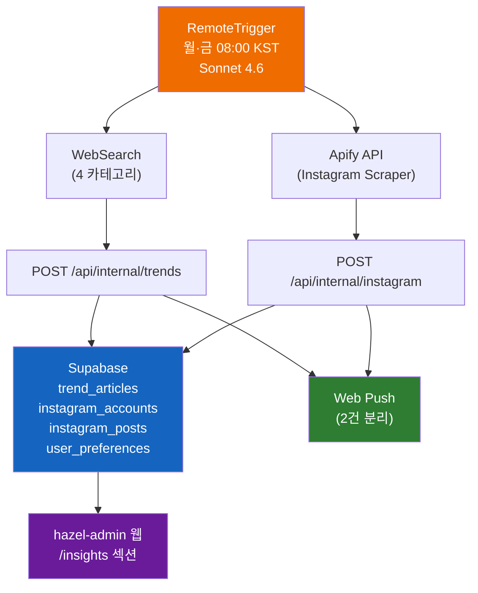

# 인사이트 섹션 설계 (트렌드 + 팔로우)

- **작성일**: 2026-04-17
- **브랜치**: `feat/insights-section`
- **담당**: Claude + 사용자

---

## 1. Overview

꽃집 운영에 필요한 **꽃/사업/업계 트렌드**와 **해외 플로리스트 Instagram 피드**를 자동 수집·저장·조회하는 인사이트 섹션을 추가한다. RemoteTrigger 루틴이 주 2회(월·금 08:00 KST) 수집 → 내부 API → Supabase 저장 → Web Push 발송 → 웹에서 조회.

### 목표
- 누나가 매장 운영 중에도 빠르게 트렌드와 영감 레퍼런스를 확인
- 데이터는 앱 내부에서 관리 (외부 서비스 의존 최소)
- 새 데이터 도착 시 푸시 알림으로 즉시 인지

### 범위 (In Scope)
- 트렌드 4카테고리(꽃/영감/사업/업계) 자동 수집 & 저장
- Instagram 16개 계정 최근 1주일 포스트 스크래핑(Apify) & 저장
- 공개 조회 페이지 3개: `/insights` (랜딩), `/insights/trends`, `/insights/follows`
- Web Push 알림 2건(트렌드/팔로우 분리)
- 사이드바 "인사이트" 섹션 추가 + 하단바 커스터마이즈(변형 C, 시각적 도크)
- Instagram 계정 관리 관리자 UI

### 비범위 (Out of Scope, 추후)
- 사용자가 직접 트렌드 추가/수정 (모든 쓰기는 루틴 전용)
- Instagram 댓글/스토리 수집
- 트렌드 북마크/좋아요 기능
- 다국어 UI

---

## 2. Architecture



### 원칙
- **공유 데이터**: 트렌드·인스타는 모든 인증 유저가 조회. `auth.uid() IS NOT NULL` RLS
- **쓰기는 Service Role Key**만: 루틴이 API 호출 → API가 Service Client로 INSERT (일반 유저 INSERT 불가)
- **중복 방지**: 트렌드 `source_url` UNIQUE, 인스타 `shortcode` UNIQUE
- **푸시 분리**: 트렌드 & 팔로우는 다른 tag로 2건 발송 (Notification Stack 각각 표시)

---

## 3. 데이터 모델

### 3.1 `trend_articles` (공유)

```sql
CREATE TABLE trend_articles (
  id UUID PRIMARY KEY DEFAULT gen_random_uuid(),
  category TEXT NOT NULL CHECK (category IN ('flower', 'inspiration', 'business', 'industry')),
  title TEXT NOT NULL,
  summary TEXT NOT NULL,
  key_points JSONB NOT NULL DEFAULT '[]',
  source_url TEXT NOT NULL,
  source_name TEXT,
  published_at TIMESTAMPTZ,
  collected_at DATE NOT NULL,
  created_at TIMESTAMPTZ DEFAULT NOW()
);

CREATE INDEX idx_trend_articles_category ON trend_articles(category);
CREATE INDEX idx_trend_articles_collected_at ON trend_articles(collected_at DESC);
CREATE UNIQUE INDEX idx_trend_articles_source_url ON trend_articles(source_url);

ALTER TABLE trend_articles ENABLE ROW LEVEL SECURITY;
CREATE POLICY "trend_articles_select" ON trend_articles FOR SELECT
  USING (auth.uid() IS NOT NULL);
```

### 3.2 `instagram_accounts` (공유)

```sql
CREATE TABLE instagram_accounts (
  id UUID PRIMARY KEY DEFAULT gen_random_uuid(),
  username TEXT NOT NULL UNIQUE,
  display_name TEXT,
  profile_url TEXT NOT NULL,
  region TEXT NOT NULL CHECK (region IN ('domestic', 'international')),
  sort_order INT DEFAULT 0,
  active BOOLEAN DEFAULT true,
  notes TEXT,
  created_at TIMESTAMPTZ DEFAULT NOW(),
  updated_at TIMESTAMPTZ DEFAULT NOW()
);

CREATE TRIGGER update_instagram_accounts_updated_at
  BEFORE UPDATE ON instagram_accounts FOR EACH ROW EXECUTE FUNCTION update_updated_at();

ALTER TABLE instagram_accounts ENABLE ROW LEVEL SECURITY;
CREATE POLICY "instagram_accounts_all" ON instagram_accounts FOR ALL
  USING (auth.uid() IS NOT NULL);
```

**시드 데이터** (최초 적용 시 사용자 제공 16계정 삽입):

| username | region | display_name |
|----------|--------|--------------|
| heartmadebykigpcn | international | Heart Made by KIG |
| futurejenn | international | Future Jenn |
| ffoliar | international | ffoliar |
| yourlondonflorist | international | Your London Florist |
| nafleur.j | international | Nafleur J |
| farishtaflowers | international | Farishta Flowers |
| dada.island | international | Dada Island |
| sohee_elletravaille | international | Sohee |
| blxxm__ | international | Blxxm |
| hamishpowell | international | Hamish Powell |
| ohhoneyflorals | international | Oh Honey Florals |
| isadiafloral | international | Isadia Floral |
| edenflorals.studio | international | Eden Florals Studio |
| madridflowerschool | international | Madrid Flower School |
| duodesfleurs_kr | domestic | Duo des Fleurs |

### 3.3 `instagram_posts` (공유)

```sql
CREATE TABLE instagram_posts (
  id UUID PRIMARY KEY DEFAULT gen_random_uuid(),
  account_id UUID NOT NULL REFERENCES instagram_accounts(id) ON DELETE CASCADE,
  shortcode TEXT NOT NULL UNIQUE,
  permalink TEXT NOT NULL,
  thumbnail_url TEXT NOT NULL,
  caption TEXT,
  like_count INT DEFAULT 0,
  posted_at TIMESTAMPTZ NOT NULL,
  scraped_at TIMESTAMPTZ DEFAULT NOW()
);

CREATE INDEX idx_instagram_posts_account_id ON instagram_posts(account_id);
CREATE INDEX idx_instagram_posts_posted_at ON instagram_posts(posted_at DESC);

ALTER TABLE instagram_posts ENABLE ROW LEVEL SECURITY;
CREATE POLICY "instagram_posts_select" ON instagram_posts FOR SELECT
  USING (auth.uid() IS NOT NULL);
```

### 3.4 `user_preferences` (유저별)

```sql
CREATE TABLE user_preferences (
  user_id UUID PRIMARY KEY REFERENCES auth.users(id) ON DELETE CASCADE,
  bottom_nav_items JSONB NOT NULL DEFAULT '["calendar","sales","expenses","customers","insights"]',
  updated_at TIMESTAMPTZ DEFAULT NOW()
);

CREATE TRIGGER update_user_preferences_updated_at
  BEFORE UPDATE ON user_preferences FOR EACH ROW EXECUTE FUNCTION update_updated_at();

ALTER TABLE user_preferences ENABLE ROW LEVEL SECURITY;
CREATE POLICY "user_preferences_all" ON user_preferences FOR ALL
  USING (auth.uid() = user_id);
```

- `bottom_nav_items`: route key 배열 (예: `["calendar","sales","expenses","customers","insights"]`)
- 4~6개 제약은 **애플리케이션 레벨**에서 검증 (DB CHECK로 JSONB 길이 제한 불가)
- 레코드 없으면 기본값 사용

### 3.5 타입 정의

```typescript
// src/types/database.ts 추가
export type TrendCategory = 'flower' | 'inspiration' | 'business' | 'industry';
export type InstagramRegion = 'domestic' | 'international';
export type NavItemKey =
  | 'calendar' | 'sales' | 'expenses' | 'customers'
  | 'gallery' | 'deposits' | 'insights' | 'follows';

export interface TrendArticle {
  id: string;
  category: TrendCategory;
  title: string;
  summary: string;
  key_points: string[];
  source_url: string;
  source_name: string | null;
  published_at: string | null;
  collected_at: string;
  created_at: string;
}

export interface InstagramAccount {
  id: string;
  username: string;
  display_name: string | null;
  profile_url: string;
  region: InstagramRegion;
  sort_order: number;
  active: boolean;
  notes: string | null;
  created_at: string;
  updated_at: string;
}

export interface InstagramPost {
  id: string;
  account_id: string;
  shortcode: string;
  permalink: string;
  thumbnail_url: string;
  caption: string | null;
  like_count: number;
  posted_at: string;
  scraped_at: string;
}

export interface UserPreferences {
  user_id: string;
  bottom_nav_items: NavItemKey[];
  updated_at: string;
}

// 상수
export const TREND_CATEGORY_LABELS: Record<TrendCategory, string> = {
  flower: '꽃 트렌드',
  inspiration: '영감',
  business: '사업 트렌드',
  industry: '업계 뉴스',
};

export const NAV_ITEM_LABELS: Record<NavItemKey, string> = {
  calendar: '캘린더',
  sales: '매출관리',
  expenses: '지출관리',
  customers: '고객관리',
  gallery: '사진첩',
  deposits: '입금대조',
  insights: '인사이트',
  follows: '팔로우',
};
```

---

## 4. API 라우트

### 4.1 `POST /api/internal/trends`

- **인증**: `Authorization: Bearer ${INTERNAL_API_KEY}` (timingSafeEqual 비교)
- **Body**: `{ articles: TrendArticleInput[] }`
- **동작**:
  1. Zod 검증
  2. Service Client로 `upsert(articles, { onConflict: 'source_url', ignoreDuplicates: true })`
  3. 신규 저장 건만 집계
  4. 0건 초과 시 `sendPushToAllUsers({ title: '트렌드 ...', tag: 'trends', url: '/insights/trends' })`
- **응답**: `{ inserted: number, skipped: number }`

### 4.2 `POST /api/internal/instagram`

- **인증**: 동일 (`INTERNAL_API_KEY`)
- **Body**: `{ posts: InstagramPostInput[] }` (각각 `username` 포함)
- **동작**:
  1. Zod 검증
  2. `username` → `account_id` 조회 (누락된 username은 skip + 로그)
  3. `upsert(posts, { onConflict: 'shortcode', ignoreDuplicates: true })`
  4. 신규 저장 건과 고유 계정 수 집계
  5. 0건 초과 시 `sendPushToAllUsers({ title: '팔로우 — 신규 포스트 N건', body: '@a, @b 외 M개 계정', tag: 'instagram', url: '/insights/follows' })`
- **응답**: `{ inserted: number, skipped: number, unknown_usernames: string[] }`

### 4.3 인증 유틸

```typescript
// src/lib/internal-auth.ts
import { timingSafeEqual } from 'node:crypto';

export function verifyInternalAuth(req: Request): boolean {
  const secret = process.env.INTERNAL_API_KEY;
  if (!secret) return false;
  const header = req.headers.get('authorization');
  if (!header) return false;
  const expected = `Bearer ${secret}`;
  if (header.length !== expected.length) return false;
  try {
    return timingSafeEqual(Buffer.from(header), Buffer.from(expected));
  } catch {
    return false;
  }
}
```

### 4.4 Service Client

```typescript
// src/lib/supabase/service.ts
import { createClient } from '@supabase/supabase-js';

export function createServiceClient() {
  return createClient(
    process.env.NEXT_PUBLIC_SUPABASE_URL!,
    process.env.SUPABASE_SERVICE_ROLE_KEY!,
    { auth: { persistSession: false } }
  );
}
```

### 4.5 환경변수 추가 (`src/lib/env.ts`)

```typescript
INTERNAL_API_KEY: z.string().min(32),  // 루틴 ↔ 앱 인증
```

새 `.env` 추가:
- `INTERNAL_API_KEY` — `openssl rand -hex 32`
- (루틴 프롬프트 내 하드코딩) `APIFY_TOKEN`, `APIFY_ACTOR`, 호출 URL

### 4.6 Server Actions (조회용)

```typescript
// src/lib/actions/insights.ts
export async function getTrendArticles(opts: {
  category?: TrendCategory;
  limit?: number;
}): Promise<TrendArticle[]>;

export async function getRecentTrends(limitPerCategory: number): Promise<Record<TrendCategory, TrendArticle[]>>;

export async function getInstagramPosts(opts: {
  accountId?: string;
  region?: InstagramRegion;
  limit?: number;
  sortBy?: 'latest' | 'likes';
}): Promise<(InstagramPost & { account: InstagramAccount })[]>;

export async function getInstagramAccounts(opts: { activeOnly?: boolean }): Promise<InstagramAccount[]>;

// 관리자 기능 (requireAuth 필수)
export async function createInstagramAccount(input: CreateInstagramAccountInput): Promise<InstagramAccount>;
export async function updateInstagramAccount(id: string, input: UpdateInstagramAccountInput): Promise<void>;
export async function deleteInstagramAccount(id: string): Promise<void>;

// 유저 설정
export async function getUserPreferences(): Promise<UserPreferences>;
export async function updateBottomNavItems(items: NavItemKey[]): Promise<void>;
```

모든 쓰기 액션은 `requireAuth()` + Zod 검증.

---

## 5. 페이지 / UI

### 5.1 `/insights` (섹션 랜딩) — Server + Client

```
src/app/(dashboard)/insights/
├── page.tsx                  # Server: getRecentTrends + getInstagramPosts 병렬
├── insights-client.tsx       # Client: 상단 stat 카드 + 트렌드 하이라이트 + 팔로우 그리드
└── components/
    ├── InsightsHero.tsx      # "이번 주 인사이트" 타이틀 + 업데이트 시각
    ├── CategoryStatCard.tsx  # 4개 카테고리 카운트 카드
    ├── TrendHighlight.tsx    # 3개 트렌드 하이라이트
    └── FollowPreviewGrid.tsx # 팔로우 최근 4~8개 썸네일
```

### 5.2 `/insights/trends`

```
src/app/(dashboard)/insights/trends/
├── page.tsx                  # Server
├── trends-client.tsx         # 필터 + 페이지네이션
└── components/
    ├── CategoryTabs.tsx      # 전체/꽃/영감/사업/업계 필터 (URL param)
    ├── TrendsList.tsx        # 일자별 그룹핑 (매출 DateGroup 패턴)
    ├── TrendCard.tsx         # 카드 (카테고리 배지 + 제목 + 요약 2줄)
    └── TrendDetailDialog.tsx # 클릭 시 상세 (key_points, 원문 링크)
```

### 5.3 `/insights/follows`

```
src/app/(dashboard)/insights/follows/
├── page.tsx                  # Server
├── follows-client.tsx
└── components/
    ├── RegionFilter.tsx      # 전체/해외/국내
    ├── SortSelect.tsx        # 최신순/좋아요순/계정별
    ├── AccountGroup.tsx      # 계정별 그룹 (기본 정렬)
    ├── PostCard.tsx          # 썸네일 + 캡션 스니펫 + 좋아요 + 날짜
    └── AccountManager.tsx    # (Dialog) 계정 추가/수정/삭제
```

- 포스트 클릭 → `window.open(permalink, '_blank', 'noopener')`
- 썸네일: Apify가 반환하는 `displayUrl` 그대로 사용. Next.js `next.config.ts`의 `images.remotePatterns`에 `scontent-*.cdninstagram.com` 추가 필요
- 계정 관리 버튼: `/insights/follows` 상단 우측에 "계정 관리" → Dialog

### 5.4 `/settings` (기존 페이지 확장)

기존 설정 페이지에 **"하단 네비게이션 커스터마이즈"** 섹션 추가:

- **변형 C: 시각적 도크 (선택된 설계)**
- 상단: 실제 하단바 모양 프리뷰 (6 슬롯)
  - 슬롯이 채워져 있으면 아이콘 + 라벨 + 우상단 × 버튼
  - 슬롯이 비어 있으면 점선 테두리 + `+` 표시
- 하단: "사용 가능한 메뉴" 칩 목록
- 상호작용:
  - 칩 → 빈 슬롯에 드래그 또는 클릭 추가
  - 슬롯 × → 해당 메뉴 제거 (칩으로 돌아감)
  - 슬롯 간 드래그 → 순서 변경
- 제약: 최소 4개, 최대 6개 (저장 버튼 비활성화로 UX 처리)
- **데스크톱 표시 시 상단에 안내** "※ 이 설정은 모바일/태블릿 화면에서 적용됩니다"

**구현 라이브러리**: `@dnd-kit/core` + `@dnd-kit/sortable`
- 이유: Tailwind-친화적, 터치 지원, React 19 호환
- 번들 추가: ~15KB gzip

### 5.5 공통 컴포넌트

- `src/components/insights/CategoryBadge.tsx`: 카테고리별 색상 배지 (꽃=rose, 영감=purple, 사업=blue, 업계=amber)
- `src/components/insights/SourceLabel.tsx`: 출처명 + 원문 열기 아이콘

---

## 6. 네비게이션 업데이트

### 6.1 Sidebar (`src/components/layout/Sidebar.tsx`)

기존 2개 섹션(매장 운영 / 고객 기록)에 **3번째 섹션 추가**:

```typescript
{
  title: '인사이트',
  items: [
    { href: '/insights', icon: TrendingUp, label: '인사이트' },
    { href: '/insights/trends', icon: Sparkles, label: '트렌드' },
    { href: '/insights/follows', icon: Heart, label: '팔로우' },
  ],
}
```

### 6.2 BottomNav (`src/components/layout/BottomNav.tsx`)

현재 7개(홈 포함) 고정 → **6개 슬롯 + 더보기** 패턴으로 리팩터:

- 기본값: `['calendar', 'sales', 'expenses', 'customers', 'insights']` + 더보기
- `user_preferences.bottom_nav_items` 있으면 그 값 사용
- 홈은 헤더 로고 클릭 또는 `/` 경로로 접근 (중앙 홈버튼 제거)
- "더보기" 탭 클릭 → `Sheet`(shadcn/ui)로 하단 슬라이드 업
  - 선택되지 않은 모든 메뉴 + 설정 링크
  - 각 항목 클릭 시 네비게이션

### 6.3 아이콘 매핑 (lucide-react)

| key | icon | label |
|-----|------|-------|
| calendar | `CalendarDays` | 캘린더 |
| sales | `Receipt` | 매출관리 |
| expenses | `Wallet` | 지출관리 |
| customers | `Users` | 고객관리 |
| gallery | `Image` | 사진첩 |
| deposits | `CreditCard` | 입금대조 |
| insights | `TrendingUp` | 인사이트 |
| follows | `Heart` | 팔로우 |

---

## 7. 푸시 알림

기존 `src/lib/actions/push.ts`의 `sendPushToAllUsers()` 재사용.

### 7.1 트렌드 푸시

```typescript
{
  title: `트렌드 — 새로운 인사이트 ${N}건`,
  body: `꽃 ${a} · 영감 ${b} · 사업 ${c} · 업계 ${d}`,
  url: '/insights/trends',
  tag: 'trends',
}
```

### 7.2 팔로우 푸시

```typescript
{
  title: `팔로우 — 신규 포스트 ${N}건`,
  body: `@${top1}, @${top2} 외 ${M}개 계정`,
  url: '/insights/follows',
  tag: 'instagram',
}
```

- tag 분리로 브라우저 알림 스택에서 2개가 각각 표시됨
- 0건이면 발송 안 함
- 기존 푸시 실패 처리(404/410만 구독 비활성화) 그대로 적용

---

## 8. RemoteTrigger 루틴

### 8.1 메타

- **이름**: `Hazel Trends & Follows`
- **모델**: `claude-sonnet-4-6`
- **크론** (UTC): `0 23 * * 0,4` — 일요일·목요일 23:00 UTC = 월요일·금요일 08:00 KST
- **allowed_tools**: `["Bash", "WebSearch", "WebFetch"]`

### 8.2 프롬프트 구조 (5단계)

```
You are Hazel Insights Collector for a flower shop admin app.

## Context
- 꽃집(헤이즐) 운영자 전용 트렌드/영감 수집 루틴
- 결과는 내부 API로 POST → Supabase 저장 → 푸시 발송
- 오늘 날짜: $(date +%Y-%m-%d)

## Step 1: Search for flower trends (WebSearch)
Run one search per category (prioritize last 7 days).

**Priority 1 — 꽃 트렌드 (category: flower):**
- "2026 시즌 인기 꽃 트렌드"
- "spring bouquet trends 2026"
- "wedding flowers 2026 trend"
- "SNS 꽃다발 디자인 인기"

**Priority 2 — 영감/레퍼런스 (category: inspiration):**
- "floristry technique 2026"
- "flower arrangement color palette 2026"
- "minimalist bouquet inspiration"

**Priority 3 — 사업 트렌드 (category: business):**
- "플라워 구독 서비스 시장 2026"
- "꽃집 마케팅 전략"
- "florist subscription growth 2026"

**Priority 4 — 업계 뉴스 (category: industry):**
- "화훼시장 동향 2026"
- "수입꽃 가격 뉴스"
- "flower import price 2026"

Extract for each hit (max 8 total, balanced across categories):
- category, title (Korean), summary (3-5 sentences Korean), key_points (2-5 bullet Korean), source_url, source_name, published_at (if available)

Skip if: source_url already exists in DB (check via GET before POST).

## Step 2: Scrape Instagram (Apify)

Fetch active accounts from API:
GET https://hazel-admin.vercel.app/api/internal/instagram-accounts
  -H "Authorization: Bearer $INTERNAL_API_KEY"

For each username, call Apify Actor `apify/instagram-profile-scraper`:
curl -X POST "https://api.apify.com/v2/acts/apify~instagram-profile-scraper/run-sync-get-dataset-items?token=$APIFY_TOKEN" \
  -H "Content-Type: application/json" \
  -d '{"usernames":[<all usernames>],"resultsLimit":10}'

Filter posts to last 7 days.
Normalize each post:
- username, shortcode (from `shortCode`), permalink (`url`), thumbnail_url (`displayUrl`), caption, like_count (`likesCount`), posted_at (`timestamp`)

## Step 3: POST to internal APIs

### Trends
curl -X POST https://hazel-admin.vercel.app/api/internal/trends \
  -H "Authorization: Bearer $INTERNAL_API_KEY" \
  -H "Content-Type: application/json" \
  -d '{"articles":[...]}'

### Instagram
curl -X POST https://hazel-admin.vercel.app/api/internal/instagram \
  -H "Authorization: Bearer $INTERNAL_API_KEY" \
  -H "Content-Type: application/json" \
  -d '{"posts":[...]}'

## Step 4: Report (Discord fallback only)

If any POST returns 4xx/5xx, send Discord webhook with error detail (fallback alert). Otherwise no further action — the apps send push notifications automatically.

## Rules
- All Korean output (title/summary/key_points).
- Skip categories with no new content.
- Max 20 trend articles per run, max 500 IG posts per run.
- If Apify returns 0 posts for any account, log & continue (don't block others).
- Deduplicate IG posts by shortcode within the request before POST.
```

### 8.3 등록

`RemoteTrigger(action: "create", body: { ... })` — `INTERNAL_API_KEY`, `APIFY_TOKEN` 등을 프롬프트에 직접 삽입 (루틴 환경은 외부 env 참조 불가).

### 8.4 `GET /api/internal/instagram-accounts`

루틴이 스크래핑할 계정 목록 조회용 (읽기 전용). Service Client로 active=true 반환.

---

## 9. 에러 처리 & 로깅

- **API 실패**: 기존 `withErrorLogging()` 래핑. 예상 에러는 `AppError`, 미지 에러는 Discord 웹훅(`src/lib/logger.ts`)
- **루틴 실패**: 프롬프트 Step 4에서 Discord 알림 (부분 실패도 리포트)
- **Apify 응답 비정상**: partial 저장 후 stderr 로그
- **푸시 발송 실패**: 기존 정책 유지(404/410만 구독 비활성화)

---

## 10. 마이그레이션

### 10.1 SQL 파일

- `supabase/migrations/2026-04-17-insights.sql` — 사용자가 Supabase SQL Editor에서 실행
- `supabase/schema.sql`에 동일 내용 추가 (전체 스키마 유지보수)

### 10.2 시드 데이터

- 동일 파일 내 `INSERT INTO instagram_accounts ... ON CONFLICT DO NOTHING;`
- 15개 계정 (사용자 제공 16개 중 heartmadebykigpcn 중복 1건 제외)

### 10.3 환경변수

- Vercel 대시보드 & `.env.example`에 `INTERNAL_API_KEY` 추가
- `openssl rand -hex 32`로 생성

---

## 11. Phase별 구현 순서

| Phase | 범위 | DoD |
|-------|------|-----|
| **1. DB & 타입** | migration SQL, `types/database.ts`, service client, internal-auth | 사용자가 DDL 적용, 타입 컴파일 통과 |
| **2. API 라우트** | `/api/internal/trends`, `/api/internal/instagram`, `/api/internal/instagram-accounts`, validations | curl로 수동 테스트 성공 |
| **3. 조회 페이지** | `/insights` 랜딩, `/insights/trends`, `/insights/follows` + Server Actions | mock 데이터로 UI 확인 |
| **4. 네비게이션** | Sidebar 새 섹션, BottomNav 더보기 Sheet | 데스크톱/모바일 경로 전환 정상 |
| **5. 하단바 커스터마이즈** | `@dnd-kit` 도입, 설정 페이지 도크 UI, `user_preferences` CRUD | 4~6개 제약, 저장/로드 동작 |
| **6. Instagram 계정 관리 UI** | `/insights/follows` 상단 Dialog, CRUD | 추가/수정/삭제 후 리스트 갱신 |
| **7. 루틴 등록** | RemoteTrigger 생성, Apify 무료 계정 & 토큰 발급 | 수동 실행 시 트렌드 1건 + 인스타 1건 이상 저장 |
| **8. 마무리** | 다크모드/접근성/빈 상태 처리, `next.config.ts` IG CDN 등록 | lint/typecheck 통과, 스모크 QA |

---

## 12. 테스트 관점

- **API 단위**: Bearer 미포함·잘못된 경우 401 / Zod 실패 시 400 / 정상 200
- **중복 방지**: 동일 source_url 2회 요청 시 두 번째 `inserted: 0`
- **푸시**: 0건일 때 발송 안 함, N건일 때 title/body 포맷 확인
- **BottomNav**: 3개만 남기면 저장 비활성화, 7개 추가 시 칩이 비활성화
- **IG 썸네일**: 유효하지 않은 CDN 도메인 차단되면 이미지 로드 실패 → fallback 플레이스홀더

---

## 13. 보안 체크리스트

- [ ] `INTERNAL_API_KEY`는 32바이트 이상, 타이밍 세이프 비교
- [ ] Service Role Key는 API 라우트 내부에서만 사용 (클라이언트 번들 유입 금지)
- [ ] Zod로 모든 입력 검증, URL은 `.url()` 체크
- [ ] `next.config.ts`의 `images.remotePatterns`에 Instagram CDN만 명시적으로 허용
- [ ] 관리자 UI CRUD 전부 `requireAuth()`
- [ ] 로그에 토큰/비밀키 노출 금지

---

## 14. Open Questions

- 누나 개인 Instagram 계정(팔로우 대상이 아닌 누나 소유) 정보가 필요한가? → No, 팔로우 목록만 필요
- Apify 무료 크레딧 소진 시 월 몇 달러 과금 수락 가능? → 우선 무료 티어로 시작, 필요시 사용자와 협의
- BottomNav 커스터마이즈를 PC에서 편집 시 실시간 프리뷰 어떻게 할지? → 모바일 뷰포트 아이콘 크기로 그대로 프리뷰 렌더링 (시각적 도크)

---

## 15. 참고

- 기존 패턴: `CLAUDE.md`, `docs/ARCHITECTURE.md`
- 크론 환경: `/Users/hansangho/.claude/skills/create-routine/SKILL.md`
- Visual Companion 선택 기록: 변형 C (Visual Dock)
